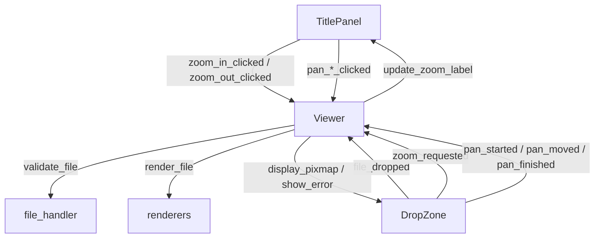
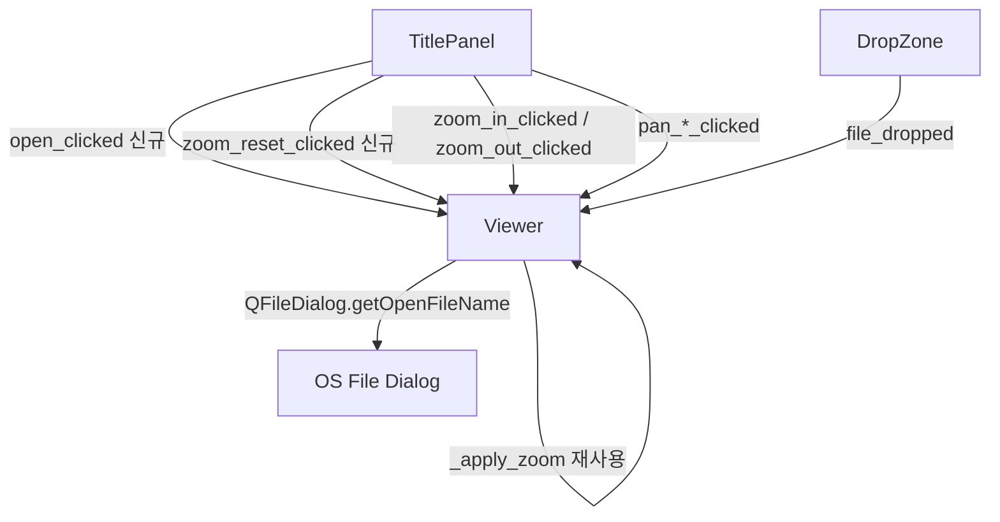
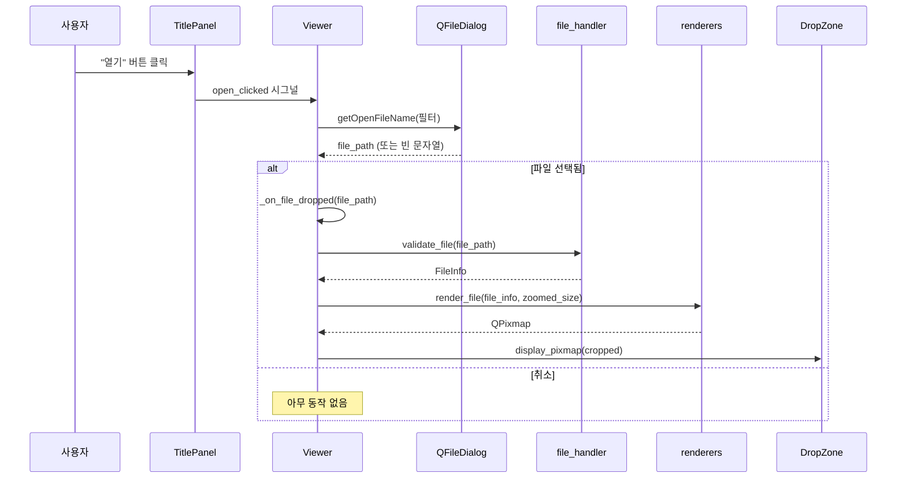
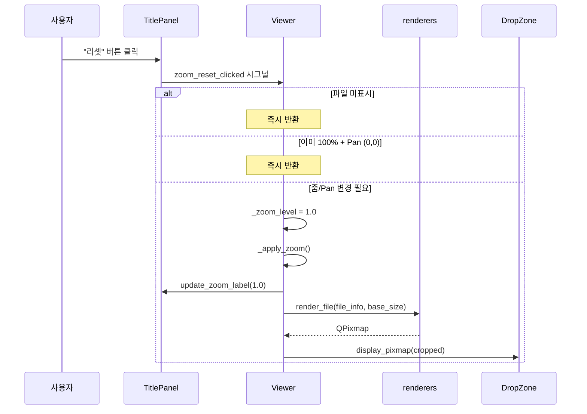

# 기술 설계 문서: 파일 열기 다이얼로그 & 줌 리셋

## 개요 (Overview)

기존 PySide6 기반 이미지/문서 뷰어 애플리케이션에 두 가지 기능을 추가한다:

1. **파일 열기 다이얼로그**: TitlePanel에 "열기" 버튼을 추가하고, 클릭 시 `QFileDialog.getOpenFileName`을 호출하여 파일을 선택·로드한다. 파일 로드 후 처리(검증, 줌/Pan 초기화, 렌더링)는 기존 `_on_file_dropped` 파이프라인을 재사용한다.
2. **줌 리셋**: TitlePanel에 "리셋" 버튼을 추가하고, 클릭 시 줌 레벨을 1.0(100%)으로, Pan 오프셋을 (0, 0)으로 초기화한 뒤 재렌더링한다. 기존 `_apply_zoom` 로직을 재사용한다.

두 기능 모두 기존 아키텍처(시그널/슬롯 패턴, TitlePanel ↔ Viewer 연결)를 그대로 따르며, 새로운 모듈이나 클래스를 추가하지 않는다.

## 아키텍처 (Architecture)

### 기존 구조



### 변경 후 구조

기존 시그널/슬롯 패턴에 두 개의 시그널을 추가한다:



**설계 결정**: 새로운 모듈이나 클래스를 도입하지 않고, 기존 TitlePanel과 Viewer에 시그널/슬롯과 메서드를 추가하는 방식을 선택했다. 두 기능 모두 단순하고 기존 로직을 재사용하므로 추가 추상화는 불필요하다.

## 컴포넌트 및 인터페이스 (Components and Interfaces)

### TitlePanel 변경사항

**새로운 시그널:**
- `open_clicked = Signal()` — "열기" 버튼 클릭 시 emit
- `zoom_reset_clicked = Signal()` — "리셋" 버튼 클릭 시 emit

**새로운 위젯:**
- `_open_button: QPushButton` — 텍스트 "열기", 레이아웃 왼쪽(안내 문구 앞)에 배치
- `_zoom_reset_button: QPushButton` — 텍스트 "리셋", Zoom_Label 오른쪽(줌 인 버튼 뒤)에 배치

**레이아웃 순서 (왼쪽 → 오른쪽):**

```
[열기] [안내 문구] --- stretch --- [◀][▲][▼][▶] [-][100%][+][리셋]
```

### Viewer 변경사항

**새로운 메서드:**
- `_on_open_clicked() -> None` — TitlePanel의 `open_clicked` 시그널 핸들러
  - `QFileDialog.getOpenFileName`을 호출하여 파일 경로를 얻는다
  - 필터: `"이미지/문서 파일 (*.png *.jpg *.jpeg *.pdf *.svg)"`
  - 사용자가 파일을 선택하면 기존 `_on_file_dropped(file_path)`를 호출한다
  - 사용자가 취소하면 아무 동작도 하지 않는다 (빈 문자열 반환 시 무시)

- `zoom_reset() -> None` — TitlePanel의 `zoom_reset_clicked` 시그널 핸들러
  - `_current_file_info`가 `None`이면 즉시 반환 (파일 미표시 상태)
  - `_zoom_level`이 이미 `DEFAULT_ZOOM`(1.0)이고 Pan 오프셋이 (0, 0)이면 즉시 반환 (불필요한 재렌더링 방지)
  - `_zoom_level`을 `DEFAULT_ZOOM`으로 설정
  - `_apply_zoom()`을 호출 (내부에서 Pan 초기화 + 줌 레이블 갱신 + 재렌더링 수행)

**새로운 시그널 연결 (`__init__` 내):**
```python
self._title_panel.open_clicked.connect(self._on_open_clicked)
self._title_panel.zoom_reset_clicked.connect(self.zoom_reset)
```

### 파일 열기 시퀀스 다이어그램



### 줌 리셋 시퀀스 다이어그램



## 데이터 모델 (Data Models)

이 기능은 새로운 데이터 모델을 도입하지 않는다. 기존 데이터 구조를 그대로 사용한다:

| 항목 | 타입 | 설명 |
|------|------|------|
| `_current_file_info` | `FileInfo \| None` | 현재 로드된 파일 정보 |
| `_zoom_level` | `float` | 현재 줌 배율 (기본값 1.0) |
| `_pan_offset_x` | `int` | 수평 Pan 오프셋 |
| `_pan_offset_y` | `int` | 수직 Pan 오프셋 |

**파일 다이얼로그 필터 문자열** (상수):
```python
_FILE_FILTER = "이미지/문서 파일 (*.png *.jpg *.jpeg *.pdf *.svg)"
```

이 필터 문자열은 `SUPPORTED_EXTENSIONS`와 동기화되어야 하지만, QFileDialog의 필터 형식 제약으로 인해 별도 문자열로 정의한다.


## 정확성 속성 (Correctness Properties)

*속성(property)이란 시스템의 모든 유효한 실행에서 참이어야 하는 특성 또는 동작을 의미한다. 속성은 사람이 읽을 수 있는 명세와 기계가 검증할 수 있는 정확성 보장 사이의 다리 역할을 한다.*

이 기능은 대부분 UI 위젯 배치와 시그널/슬롯 연결로 구성되어 PBT 적용 범위가 제한적이다. 그러나 `zoom_reset` 메서드의 상태 초기화 로직은 다양한 줌 레벨과 Pan 오프셋 조합에 대해 속성 테스트가 유의미하다.

### Property 1: 줌 리셋 상태 초기화

*For any* 유효한 줌 레벨(MIN_ZOOM ≤ zoom ≤ MAX_ZOOM)과 *for any* Pan 오프셋 (pan_x, pan_y)에서, 파일이 로드된 상태에서 `zoom_reset`을 호출하면, 줌 레벨은 반드시 1.0이 되고 Pan 오프셋은 반드시 (0, 0)이 되어야 한다.

**Validates: Requirements 5.1, 5.2**

## 오류 처리 (Error Handling)

### 파일 열기 다이얼로그

| 시나리오 | 처리 방식 |
|----------|-----------|
| 사용자가 다이얼로그를 취소 | `QFileDialog.getOpenFileName`이 빈 문자열 반환 → 아무 동작 없음 |
| 지원하지 않는 파일 형식 선택 | 다이얼로그 필터가 지원 형식만 표시하므로 발생 가능성 낮음. 만약 발생하면 `FileValidationError` → `show_error()` |
| 파일 읽기 실패 (권한, 삭제 등) | `FileValidationError` → `show_error()` |
| 파일 크기 초과 (100MB) | `FileValidationError` → `show_error()` |
| 렌더링 실패 (손상된 파일) | `RenderError` → `show_error()` |

모든 에러 처리는 기존 `_on_file_dropped` 파이프라인의 try/except 블록을 그대로 재사용한다.

### 줌 리셋

| 시나리오 | 처리 방식 |
|----------|-----------|
| 파일 미표시 상태에서 클릭 | `_current_file_info is None` → 즉시 반환 |
| 이미 100% + Pan (0,0) 상태 | 조건 검사 후 즉시 반환 (불필요한 재렌더링 방지) |

줌 리셋은 기존 `_apply_zoom`을 호출하므로, 렌더링 중 발생하는 `RenderError`도 기존 에러 처리 경로를 따른다.

## 테스트 전략 (Testing Strategy)

### 테스트 프레임워크

- **단위 테스트**: pytest + pytest-qt (기존 프로젝트 설정 그대로 사용)
- **속성 테스트**: hypothesis (이미 dev 의존성에 포함됨)
- **Mock**: `unittest.mock.patch` (QFileDialog 등 시스템 대화 상자 mock)

### 단위 테스트 (Example-Based)

**TitlePanel 테스트:**
- "열기" 버튼이 존재하고 텍스트가 "열기"인지 확인 (요구사항 1.1)
- "리셋" 버튼이 존재하고 텍스트가 "리셋"인지 확인 (요구사항 4.1, 4.2)
- "열기" 버튼 클릭 시 `open_clicked` 시그널이 emit되는지 확인
- "리셋" 버튼 클릭 시 `zoom_reset_clicked` 시그널이 emit되는지 확인

**Viewer — 파일 열기 다이얼로그 테스트:**
- `_on_open_clicked` 호출 시 `QFileDialog.getOpenFileName`이 올바른 필터로 호출되는지 확인 (요구사항 1.2, 1.3, 1.4)
- 파일 선택 시 `_on_file_dropped`가 해당 경로로 호출되는지 확인 (요구사항 2.1)
- 다이얼로그 취소 시 상태가 변경되지 않는지 확인 (요구사항 3.1, 3.2, 3.3)

**Viewer — 줌 리셋 테스트:**
- 파일 미표시 상태에서 `zoom_reset` 호출 시 아무 동작 없음 확인 (요구사항 6.1)
- 이미 100% + Pan (0,0) 상태에서 `zoom_reset` 호출 시 재렌더링 없음 확인 (요구사항 7.1)
- `zoom_reset` 호출 후 줌 레이블이 "100%"로 갱신되는지 확인 (요구사항 5.4)
- `zoom_reset` 호출 후 렌더링이 수행되는지 확인 (요구사항 5.3)

### 속성 테스트 (Property-Based)

- **라이브러리**: hypothesis
- **최소 반복 횟수**: 100회
- **태그 형식**: `Feature: file-dialog-zoom-reset, Property {number}: {property_text}`

**Property 1 테스트:**
- hypothesis의 `floats()`와 `integers()`를 사용하여 임의의 줌 레벨(MIN_ZOOM ~ MAX_ZOOM)과 Pan 오프셋을 생성
- Viewer 인스턴스에 해당 상태를 설정한 후 `zoom_reset()` 호출
- `_zoom_level == 1.0`, `_pan_offset_x == 0`, `_pan_offset_y == 0` 검증
