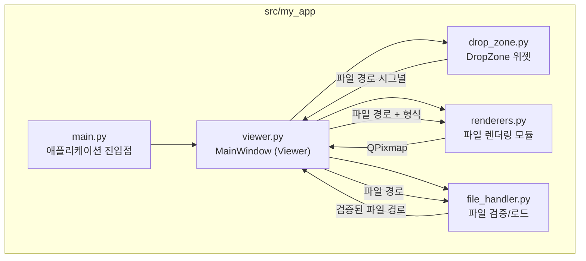
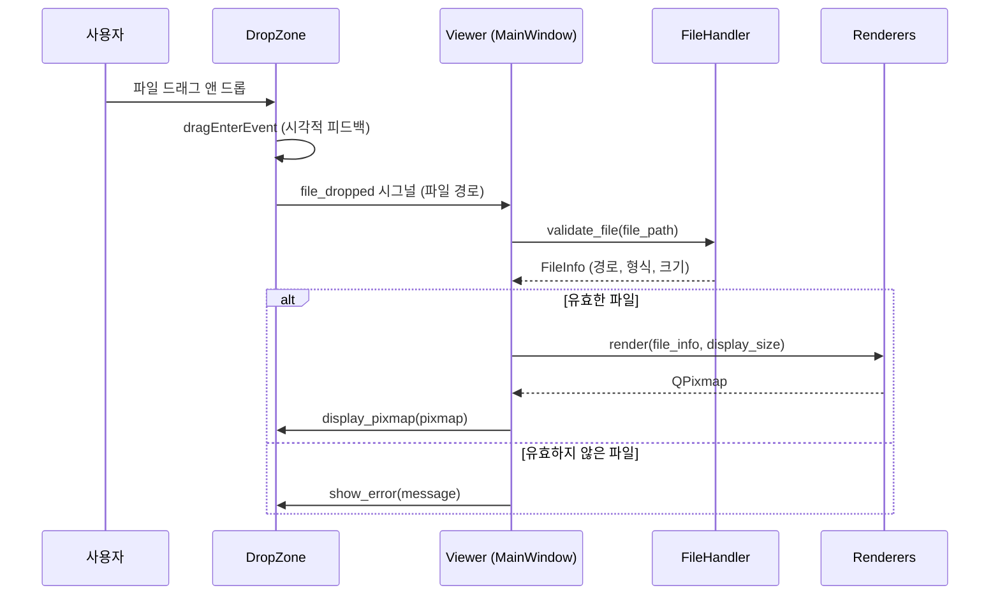
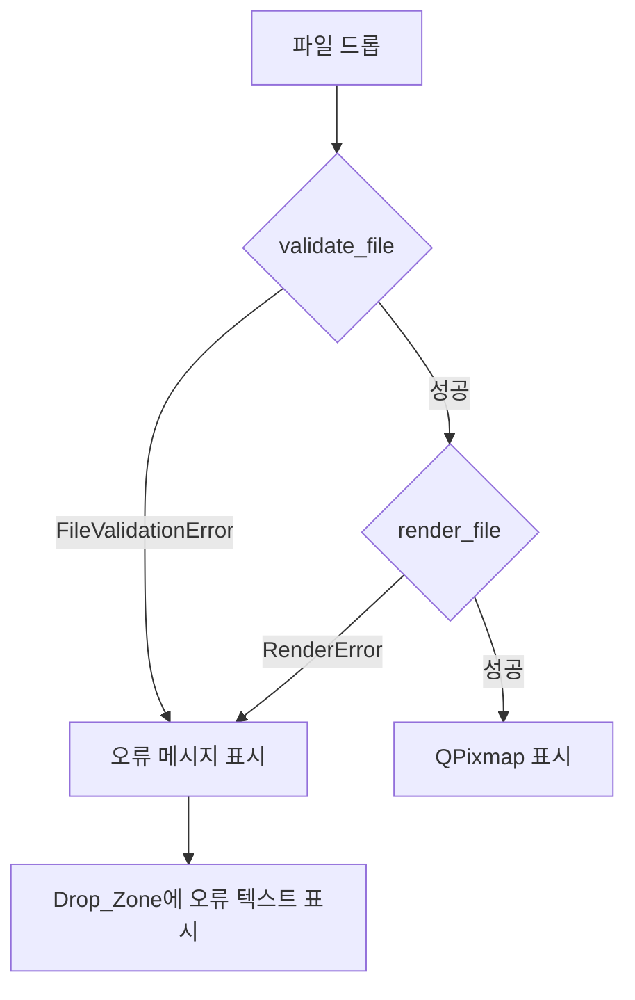

# 기술 설계 문서: Image & Document Viewer

## 개요

PySide6 기반 데스크톱 이미지/문서 뷰어 애플리케이션의 기술 설계 문서이다. 사용자가 PNG, JPG, PDF, SVG 파일을 드래그 앤 드롭하면 해당 파일을 화면에 렌더링한다.

### 핵심 기술 스택

| 항목 | 기술 |
|------|------|
| GUI 프레임워크 | PySide6 (Qt 6) |
| PDF 렌더링 | PyMuPDF (fitz) |
| SVG 렌더링 | PySide6.QtSvg (QSvgRenderer) |
| 이미지 렌더링 | PySide6.QtGui (QPixmap, QImage) |
| 패키지 관리 | uv |
| 빌드/배포 | PyInstaller (onefile, console=False) |
| 린터 | ruff |
| 타입체커 | mypy (strict) |
| 테스트 | pytest |
| Python | 3.12 |

### 설계 결정 사항

1. **PyMuPDF 선택 이유**: PDF 첫 페이지를 이미지로 변환하는 데 가장 성숙하고 빠른 라이브러리이다. `page.get_pixmap()`으로 PDF 페이지를 픽셀맵으로 직접 변환할 수 있어 PySide6의 QPixmap과 자연스럽게 연동된다.
2. **QSvgRenderer 선택 이유**: PySide6에 내장된 SVG 렌더링 엔진으로, 별도 의존성 없이 SVG를 QPainter를 통해 렌더링할 수 있다. QSvgWidget 대신 QSvgRenderer를 사용하여 Display_Area 크기에 맞춘 커스텀 렌더링이 가능하다.
3. **QLabel + QPixmap 기반 표시**: 이미지와 PDF 렌더링 결과를 QPixmap으로 통일하여 QLabel에 표시한다. 단순하고 메모리 효율적이다.
4. **단일 위젯 구조**: 복잡한 멀티 탭이나 페이지 네비게이션 없이, 하나의 Display_Area에 하나의 파일만 표시하는 단순한 구조를 채택한다.

## 아키텍처

### 전체 구조



### 데이터 흐름



## 컴포넌트 및 인터페이스

### 1. main.py — 애플리케이션 진입점

```python
def main() -> None:
    """QApplication을 생성하고 Viewer 윈도우를 표시한다."""
```

- `QApplication` 인스턴스를 생성한다.
- `Viewer` (MainWindow)를 생성하고 `show()`를 호출한다.
- `sys.exit(app.exec())`로 이벤트 루프를 실행한다.

### 2. viewer.py — MainWindow (Viewer)

```python
class Viewer(QMainWindow):
    """메인 윈도우. DropZone을 중앙 위젯으로 포함한다."""

    def __init__(self) -> None:
        """800x600 크기, 제목 설정, DropZone 초기화."""

    def _on_file_dropped(self, file_path: str) -> None:
        """DropZone의 file_dropped 시그널 핸들러."""

    def _render_file(self, file_info: FileInfo) -> None:
        """FileInfo를 기반으로 적절한 렌더러를 호출하고 결과를 표시한다."""

    def _cleanup_previous(self) -> None:
        """이전 파일의 리소스를 해제한다."""

    def resizeEvent(self, event: QResizeEvent) -> None:
        """윈도우 크기 변경 시 현재 이미지를 재조정한다."""
```

### 3. drop_zone.py — DropZone 위젯

```python
class DropZone(QLabel):
    """드래그 앤 드롭을 수신하고 파일 내용을 표시하는 위젯."""

    file_dropped: Signal  # Signal(str) - 드롭된 파일 경로

    def __init__(self, parent: QWidget | None = None) -> None:
        """안내 메시지 표시, 드롭 활성화."""

    def dragEnterEvent(self, event: QDragEnterEvent) -> None:
        """드래그 진입 시 시각적 피드백 표시."""

    def dragLeaveEvent(self, event: QDragLeaveEvent) -> None:
        """드래그 이탈 시 시각적 피드백 제거."""

    def dropEvent(self, event: QDropEvent) -> None:
        """드롭 시 첫 번째 파일 경로를 시그널로 전달."""

    def display_pixmap(self, pixmap: QPixmap) -> None:
        """QPixmap을 Display_Area에 표시한다."""

    def show_error(self, message: str) -> None:
        """오류 메시지를 Display_Area에 표시한다."""

    def show_placeholder(self) -> None:
        """안내 메시지를 표시한다."""
```

### 4. file_handler.py — 파일 검증/로드

```python
SUPPORTED_EXTENSIONS: Final[frozenset[str]] = frozenset({".png", ".jpg", ".jpeg", ".pdf", ".svg"})
MAX_FILE_SIZE: Final[int] = 100 * 1024 * 1024  # 100MB

class FileFormat(Enum):
    """지원하는 파일 형식."""
    PNG = "png"
    JPG = "jpg"
    PDF = "pdf"
    SVG = "svg"

@dataclass(frozen=True)
class FileInfo:
    """검증된 파일 정보."""
    path: Path
    format: FileFormat
    size: int

class FileValidationError(Exception):
    """파일 검증 실패 시 발생하는 예외."""
    pass

def validate_file(file_path: str) -> FileInfo:
    """파일 경로를 검증하고 FileInfo를 반환한다.

    Raises:
        FileValidationError: 지원하지 않는 형식, 크기 초과, 파일 없음 등
    """

def detect_format(file_path: Path) -> FileFormat:
    """파일 확장자를 기반으로 FileFormat을 결정한다.

    Raises:
        FileValidationError: 지원하지 않는 확장자
    """
```

### 5. renderers.py — 파일 렌더링 모듈

```python
def render_file(file_info: FileInfo, display_size: QSize) -> QPixmap:
    """FileInfo에 따라 적절한 렌더러를 호출하여 QPixmap을 반환한다.

    Raises:
        RenderError: 렌더링 실패 시
    """

def render_image(file_path: Path, display_size: QSize) -> QPixmap:
    """PNG/JPG 이미지를 로드하고 display_size에 맞게 축소한 QPixmap을 반환한다."""

def render_pdf(file_path: Path, display_size: QSize) -> QPixmap:
    """PDF 첫 페이지를 이미지로 변환하고 display_size에 맞게 축소한 QPixmap을 반환한다.

    PyMuPDF(fitz)를 사용하여 첫 페이지를 Pixmap으로 변환한 후,
    QImage → QPixmap으로 변환한다.
    """

def render_svg(file_path: Path, display_size: QSize) -> QPixmap:
    """SVG를 렌더링하고 display_size에 맞게 축소한 QPixmap을 반환한다.

    QSvgRenderer를 사용하여 QPainter로 QPixmap에 직접 렌더링한다.
    """

def scale_pixmap(pixmap: QPixmap, display_size: QSize) -> QPixmap:
    """QPixmap을 종횡비를 유지하면서 display_size에 맞게 축소한다.

    Qt.AspectRatioMode.KeepAspectRatio를 사용한다.
    원본이 display_size보다 작으면 원본 크기를 유지한다.
    """

class RenderError(Exception):
    """렌더링 실패 시 발생하는 예외."""
    pass
```

## 데이터 모델

### FileFormat (Enum)

| 값 | 설명 | 확장자 |
|----|------|--------|
| `PNG` | PNG 이미지 | `.png` |
| `JPG` | JPEG 이미지 | `.jpg`, `.jpeg` |
| `PDF` | PDF 문서 | `.pdf` |
| `SVG` | SVG 벡터 그래픽 | `.svg` |

### FileInfo (dataclass)

| 필드 | 타입 | 설명 |
|------|------|------|
| `path` | `Path` | 파일의 절대 경로 |
| `format` | `FileFormat` | 감지된 파일 형식 |
| `size` | `int` | 파일 크기 (바이트) |

### 상수

| 상수 | 값 | 설명 |
|------|-----|------|
| `SUPPORTED_EXTENSIONS` | `{".png", ".jpg", ".jpeg", ".pdf", ".svg"}` | 지원하는 파일 확장자 집합 |
| `MAX_FILE_SIZE` | `104,857,600` (100MB) | 최대 허용 파일 크기 |
| `DEFAULT_WINDOW_WIDTH` | `800` | 기본 윈도우 너비 |
| `DEFAULT_WINDOW_HEIGHT` | `600` | 기본 윈도우 높이 |
| `WINDOW_TITLE` | `"Image & Document Viewer"` | 윈도우 제목 |


## 정확성 속성 (Correctness Properties)

*정확성 속성(property)은 시스템의 모든 유효한 실행에서 참이어야 하는 특성 또는 동작이다. 사람이 읽을 수 있는 명세와 기계가 검증할 수 있는 정확성 보장 사이의 다리 역할을 한다.*

### Property 1: 종횡비 보존 축소 (Aspect Ratio Preservation)

*For any* 원본 QPixmap 크기 (w, h)와 디스플레이 크기 (dw, dh)에 대해, `scale_pixmap`을 적용한 결과의 종횡비(w/h)는 원본의 종횡비와 동일해야 하며(정수 반올림 오차 허용), 결과 크기는 디스플레이 크기를 초과하지 않아야 한다.

**Validates: Requirements 3.3, 4.2, 5.2**

### Property 2: 비지원 확장자 거부 (Unsupported Extension Rejection)

*For any* 파일 확장자가 `.png`, `.jpg`, `.jpeg`, `.pdf`, `.svg`에 포함되지 않는 파일 경로에 대해, `detect_format`은 항상 `FileValidationError`를 발생시켜야 한다.

**Validates: Requirements 2.3**

### Property 3: 다중 파일 드롭 시 첫 번째 파일만 선택 (First File Selection)

*For any* 길이가 1 이상인 파일 경로 목록에 대해, 드롭 처리 로직은 항상 목록의 첫 번째 파일 경로만 반환해야 한다.

**Validates: Requirements 2.4**

### Property 4: 파일 크기 초과 거부 (File Size Limit Enforcement)

*For any* 파일 크기가 100MB(104,857,600 바이트)를 초과하는 파일에 대해, `validate_file`은 항상 `FileValidationError`를 발생시켜야 한다.

**Validates: Requirements 7.3**

## 오류 처리

### 오류 유형 및 처리 전략

| 오류 상황 | 예외 타입 | 사용자 메시지 | 처리 위치 |
|-----------|-----------|---------------|-----------|
| 지원하지 않는 파일 형식 | `FileValidationError` | "지원하지 않는 파일 형식입니다" | `file_handler.validate_file` |
| 파일 크기 초과 (>100MB) | `FileValidationError` | "파일 크기가 너무 큽니다 (최대 100MB)" | `file_handler.validate_file` |
| 파일 읽기 I/O 오류 | `FileValidationError` | "파일을 읽을 수 없습니다: [파일명]" | `file_handler.validate_file` |
| 이미지 디코딩 실패 | `RenderError` | "이미지 파일이 손상되었습니다: [파일명]" | `renderers.render_image` |
| PDF 렌더링 실패 | `RenderError` | "PDF 파일을 열 수 없습니다" | `renderers.render_pdf` |
| SVG 렌더링 실패 | `RenderError` | "SVG 파일을 열 수 없습니다" | `renderers.render_svg` |

### 오류 처리 흐름



### 오류 처리 원칙

1. **모든 예외는 Viewer 레벨에서 포착한다**: `_on_file_dropped`와 `_render_file` 메서드에서 `FileValidationError`와 `RenderError`를 포착하여 사용자에게 메시지를 표시한다.
2. **예외가 전파되지 않도록 한다**: 렌더링 실패가 애플리케이션 크래시로 이어지지 않도록 한다.
3. **오류 메시지는 Display_Area에 표시한다**: 별도의 다이얼로그 대신 Drop_Zone의 `show_error` 메서드를 사용하여 인라인으로 표시한다.
4. **리소스 정리**: 오류 발생 시에도 이전 파일의 리소스를 해제한다.

## 테스트 전략

### 테스트 프레임워크 및 도구

| 도구 | 용도 |
|------|------|
| pytest | 테스트 실행기 |
| hypothesis | Property-based testing 라이브러리 |
| pytest-qt | PySide6 위젯 테스트 지원 |

### 이중 테스트 접근법

#### 1. Property-Based Tests (hypothesis)

각 정확성 속성에 대해 하나의 property-based 테스트를 작성한다. 최소 100회 반복 실행한다.

- **Property 1**: 임의의 (width, height, display_width, display_height) 조합으로 `scale_pixmap` 호출 후 종횡비 보존 및 크기 제한 확인
  - 태그: `Feature: image-pdf-svg-viewer, Property 1: Aspect Ratio Preservation`
- **Property 2**: 임의의 비지원 확장자 문자열 생성 후 `detect_format` 호출 시 `FileValidationError` 발생 확인
  - 태그: `Feature: image-pdf-svg-viewer, Property 2: Unsupported Extension Rejection`
- **Property 3**: 임의 길이의 파일 경로 목록 생성 후 첫 번째 파일만 선택되는지 확인
  - 태그: `Feature: image-pdf-svg-viewer, Property 3: First File Selection`
- **Property 4**: 100MB 초과 크기값 생성 후 `validate_file` 호출 시 `FileValidationError` 발생 확인
  - 태그: `Feature: image-pdf-svg-viewer, Property 4: File Size Limit Enforcement`

#### 2. Unit Tests (pytest)

구체적인 예제와 에지 케이스를 테스트한다.

- **파일 검증 단위 테스트**:
  - 각 지원 형식(.png, .jpg, .jpeg, .pdf, .svg)에 대한 `detect_format` 정상 동작
  - 대소문자 혼합 확장자(.PNG, .Jpg) 처리
  - 존재하지 않는 파일 경로에 대한 오류 처리

- **렌더링 단위 테스트**:
  - 테스트용 PNG/JPG 파일 렌더링 성공
  - 테스트용 PDF 파일 첫 페이지 렌더링 성공
  - 테스트용 SVG 파일 렌더링 성공
  - 손상된 파일에 대한 RenderError 발생

- **DropZone 위젯 테스트** (pytest-qt):
  - 초기 안내 메시지 표시 확인
  - 드래그 진입/이탈 시 시각적 피드백 확인
  - 드롭 이벤트 시 file_dropped 시그널 발생 확인

- **Viewer 통합 테스트** (pytest-qt):
  - 윈도우 크기 및 제목 확인
  - 파일 교체 동작 확인
  - 윈도우 리사이즈 시 이미지 재조정 확인

### 테스트 디렉토리 구조

```
tests/
├── conftest.py              # 공통 fixture (테스트용 파일 생성 등)
├── test_file_handler.py     # file_handler 단위 테스트 + property 테스트
├── test_renderers.py        # renderers 단위 테스트
├── test_drop_zone.py        # DropZone 위젯 테스트
└── test_viewer.py           # Viewer 통합 테스트
```

### Property-Based Testing 설정

```python
from hypothesis import given, settings, strategies as st

@settings(max_examples=100)
@given(...)
def test_property_name(...):
    # Feature: image-pdf-svg-viewer, Property N: property_text
    ...
```
