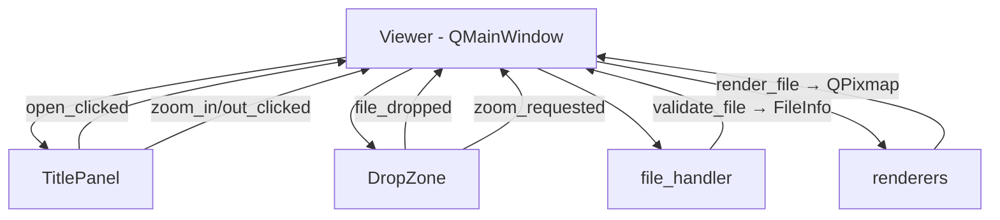
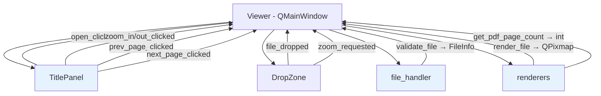
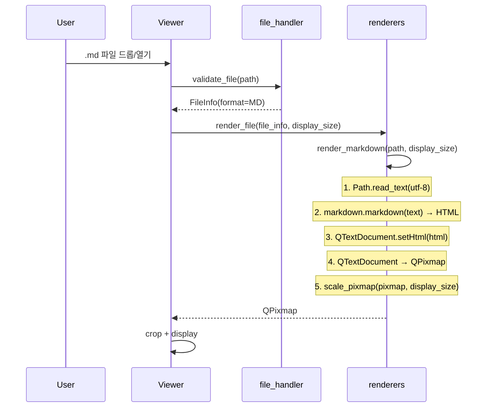
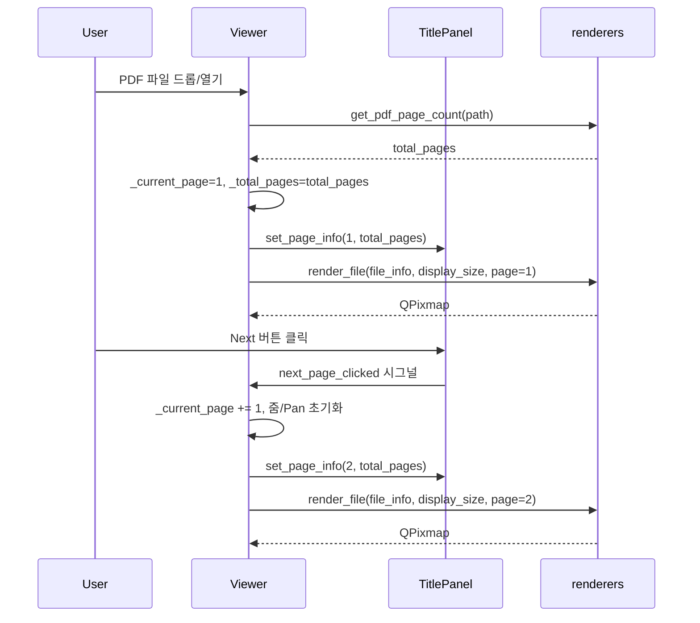

# 기술 설계 문서: Markdown 렌더링 및 PDF 멀티 페이지

## 개요

기존 PySide6 기반 이미지/문서 뷰어(SvgViewer)에 두 가지 핵심 기능을 추가한다.

1. **Markdown 렌더링**: Python `markdown` 라이브러리로 `.md` 파일을 HTML로 변환한 뒤, Qt의 `QTextDocument`를 사용하여 HTML을 이미지(`QPixmap`)로 렌더링한다. QWebEngine 의존성 없이 가볍게 구현한다.
2. **PDF 멀티 페이지 탐색**: 기존 `render_pdf`가 첫 페이지만 렌더링하던 것을 확장하여, 특정 페이지를 지정하여 렌더링하고, TitlePanel에 페이지 네비게이션 UI(◁ [n/N] ▷)를 추가한다.

### 설계 원칙

- **최소 변경**: 기존 아키텍처(Viewer → TitlePanel + DropZone, renderers, file_handler)를 유지하면서 확장한다.
- **단일 책임**: 각 모듈의 역할 경계를 유지한다. 렌더링 로직은 `renderers.py`, 파일 검증은 `file_handler.py`, UI 상태 관리는 `viewer.py`.
- **시그널/슬롯 패턴**: Qt의 시그널/슬롯 메커니즘을 활용하여 컴포넌트 간 느슨한 결합을 유지한다.

## 아키텍처

### 기존 아키텍처



### 변경 후 아키텍처



변경되는 모듈은 파란색으로 표시. 새로운 시그널(`prev_page_clicked`, `next_page_clicked`)과 새로운 함수(`get_pdf_page_count`, `render_markdown`)가 추가된다.

### 데이터 흐름

#### Markdown 렌더링 흐름



#### PDF 멀티 페이지 탐색 흐름



## 컴포넌트 및 인터페이스

### 1. file_handler.py 변경사항

#### FileFormat 열거형 확장

```python
class FileFormat(Enum):
    PNG = "png"
    JPG = "jpg"
    PDF = "pdf"
    SVG = "svg"
    MD = "md"          # 신규
```

#### SUPPORTED_EXTENSIONS 확장

```python
SUPPORTED_EXTENSIONS: Final[frozenset[str]] = frozenset(
    {".png", ".jpg", ".jpeg", ".pdf", ".svg", ".md"}
)
```

#### detect_format 함수 확장

`.md` 확장자에 대해 `FileFormat.MD`를 반환하도록 분기를 추가한다.

### 2. renderers.py 변경사항

#### 신규 함수: render_markdown

```python
def render_markdown(file_path: Path, display_size: QSize) -> QPixmap:
    """Markdown 파일을 HTML로 변환 후 QPixmap으로 렌더링한다.

    1. file_path에서 UTF-8 텍스트를 읽는다.
    2. markdown.markdown()으로 HTML 변환한다 (extensions: ['fenced_code', 'tables']).
    3. QTextDocument에 HTML을 설정하고, 문서 너비를 display_size.width()로 제한한다.
    4. QTextDocument를 QPixmap으로 렌더링한다.
    5. scale_pixmap으로 display_size에 맞게 스케일링한다.

    Raises:
        RenderError: 파일 읽기 실패 시
    """
```

**설계 결정**: QWebEngine 대신 `QTextDocument`를 사용한다.
- **장점**: 추가 의존성 없음, 가벼움, 기본 Markdown 문법(제목, 목록, 코드 블록, 강조, 링크, 테이블) 충분히 지원.
- **단점**: 복잡한 CSS 스타일링이나 JavaScript 기반 Markdown 확장은 미지원. 이 프로젝트에서는 불필요.

#### render_pdf 함수 확장

```python
def render_pdf(file_path: Path, display_size: QSize, page: int = 1) -> QPixmap:
    """PDF의 지정된 페이지를 이미지로 변환하고 스케일링한 QPixmap을 반환한다.

    Args:
        file_path: PDF 파일 경로
        display_size: 렌더링 대상 크기
        page: 렌더링할 페이지 번호 (1-based, 기본값 1)

    Raises:
        RenderError: PDF 열기 실패 또는 페이지 번호가 유효 범위를 벗어날 때
    """
```

기존 `render_pdf`에 `page` 파라미터를 추가한다. 기본값이 1이므로 기존 호출 코드와 하위 호환성을 유지한다.

#### 신규 함수: get_pdf_page_count

```python
def get_pdf_page_count(file_path: Path) -> int:
    """PDF 파일의 총 페이지 수를 반환한다.

    Raises:
        RenderError: PDF 열기 실패 시
    """
```

PyMuPDF(`fitz`)의 `len(doc)`을 사용하여 총 페이지 수를 반환한다.

#### render_file 함수 확장

```python
def render_file(file_info: FileInfo, display_size: QSize, page: int = 1) -> QPixmap:
    """FileInfo에 따라 적절한 렌더러를 호출하여 QPixmap을 반환한다.

    Args:
        file_info: 검증된 파일 정보
        display_size: 렌더링 대상 크기
        page: PDF 페이지 번호 (1-based, PDF가 아닌 경우 무시)
    """
```

`FileFormat.MD`에 대해 `render_markdown`을 호출하고, `FileFormat.PDF`에 대해 `page` 파라미터를 전달한다.

### 3. title_panel.py 변경사항

#### 페이지 네비게이션 위젯 추가

```python
class TitlePanel(QWidget):
    # 기존 시그널들...
    prev_page_clicked = Signal()   # 신규
    next_page_clicked = Signal()   # 신규

    def __init__(self, parent=None):
        # 기존 레이아웃에 페이지 네비게이션 위젯 추가
        # 위치: 방향 버튼과 줌 컨트롤 사이
        self._prev_button = QPushButton("◁")
        self._page_label = QLabel("")
        self._next_button = QPushButton("▷")
        # 초기 상태: 숨김
        self._prev_button.setVisible(False)
        self._page_label.setVisible(False)
        self._next_button.setVisible(False)

    def set_page_info(self, current: int, total: int) -> None:
        """페이지 정보를 갱신하고 네비게이션 위젯의 표시/숨김을 제어한다.

        Args:
            current: 현재 페이지 번호 (1-based)
            total: 총 페이지 수

        - total <= 1이면 네비게이션 위젯을 숨긴다.
        - total > 1이면 네비게이션 위젯을 표시하고:
          - Page_Label을 "current/total" 형식으로 갱신
          - current == 1이면 Prev_Button 비활성화
          - current == total이면 Next_Button 비활성화
        """

    def hide_page_nav(self) -> None:
        """페이지 네비게이션 위젯을 숨긴다."""
```

### 4. viewer.py 변경사항

#### 상태 추가

```python
class Viewer(QMainWindow):
    def __init__(self):
        # 기존 상태...
        self._current_page: int = 1       # 신규: 현재 페이지 (1-based)
        self._total_pages: int = 1        # 신규: 총 페이지 수
```

#### 시그널 연결 추가

```python
self._title_panel.prev_page_clicked.connect(self._on_prev_page)
self._title_panel.next_page_clicked.connect(self._on_next_page)
```

#### 파일 열기 다이얼로그 필터 변경

```python
_FILE_FILTER = "이미지/문서 파일 (*.png *.jpg *.jpeg *.pdf *.svg *.md)"
```

#### 신규 메서드

```python
def _on_prev_page(self) -> None:
    """이전 페이지로 이동한다. 줌/Pan을 초기화하고 재렌더링한다."""

def _on_next_page(self) -> None:
    """다음 페이지로 이동한다. 줌/Pan을 초기화하고 재렌더링한다."""
```

#### _on_file_dropped 변경

PDF 파일 로드 시 `get_pdf_page_count`를 호출하여 `_total_pages`를 설정하고, `_current_page`를 1로 초기화한다. PDF가 아닌 파일 로드 시 페이지 네비게이션을 숨긴다.

#### _render_file 변경

`render_file` 호출 시 `page=self._current_page`를 전달한다.

### 5. drop_zone.py 변경사항

#### 안내 메시지 변경

```python
_PLACEHOLDER_TEXT = "파일을 여기에 드래그 앤 드롭하세요 (PNG, JPG, PDF, SVG, MD)"
```

## 데이터 모델

### 기존 데이터 모델 (변경 없음)

| 클래스 | 필드 | 설명 |
|--------|------|------|
| `FileInfo` | `path: Path` | 파일 경로 |
| | `format: FileFormat` | 파일 형식 |
| | `size: int` | 파일 크기 (bytes) |

### FileFormat 열거형 (확장)

| 값 | 설명 | 상태 |
|----|------|------|
| `PNG` | PNG 이미지 | 기존 |
| `JPG` | JPG/JPEG 이미지 | 기존 |
| `PDF` | PDF 문서 | 기존 |
| `SVG` | SVG 벡터 이미지 | 기존 |
| `MD` | Markdown 문서 | **신규** |

### Viewer 상태 모델 (확장)

| 상태 | 타입 | 기본값 | 설명 |
|------|------|--------|------|
| `_current_file_info` | `FileInfo \| None` | `None` | 현재 로드된 파일 정보 |
| `_zoom_level` | `float` | `1.0` | 현재 줌 레벨 |
| `_pan_offset_x` | `int` | `0` | 수평 Pan 오프셋 |
| `_pan_offset_y` | `int` | `0` | 수직 Pan 오프셋 |
| `_current_page` | `int` | `1` | **신규**: 현재 페이지 번호 (1-based) |
| `_total_pages` | `int` | `1` | **신규**: 총 페이지 수 |

### 의존성 추가

`pyproject.toml`에 `markdown` 라이브러리를 추가한다:

```toml
dependencies = [
    "PySide6>=6.7,<7",
    "PyMuPDF>=1.24,<2",
    "markdown>=3.7,<4",
]
```


## 정확성 속성 (Correctness Properties)

*속성(Property)은 시스템의 모든 유효한 실행에서 참이어야 하는 특성 또는 동작이다. 속성은 사람이 읽을 수 있는 명세와 기계가 검증할 수 있는 정확성 보장 사이의 다리 역할을 한다.*

### Property 1: Markdown 렌더링은 유효하고 크기가 적절한 QPixmap을 생성한다

*For any* 유효한 Markdown 텍스트와 *for any* 양의 정수 display_size에 대해, `render_markdown`은 null이 아닌 QPixmap을 반환하며, 반환된 QPixmap의 너비와 높이는 각각 display_size의 너비와 높이를 초과하지 않아야 한다.

**Validates: Requirements 2.1, 2.2, 2.5**

### Property 2: PDF 페이지 수 정확성

*For any* N 페이지(1 ≤ N ≤ 20)로 생성된 PDF 파일에 대해, `get_pdf_page_count`는 정확히 N을 반환해야 한다.

**Validates: Requirements 4.1**

### Property 3: 페이지 레이블 형식 정확성

*For any* 유효한 (current, total) 쌍 (1 ≤ current ≤ total, total ≥ 2)에 대해, `set_page_info(current, total)` 호출 후 Page_Label의 텍스트는 정확히 `"current/total"` 형식이어야 한다.

**Validates: Requirements 5.2**

### Property 4: 네비게이션 버튼 활성화/비활성화 정확성

*For any* 유효한 (current, total) 쌍 (1 ≤ current ≤ total, total ≥ 2)에 대해, `set_page_info(current, total)` 호출 후:
- current == 1이면 Prev_Button은 비활성화(disabled)되어야 한다
- current == total이면 Next_Button은 비활성화(disabled)되어야 한다
- 1 < current < total이면 두 버튼 모두 활성화(enabled)되어야 한다

**Validates: Requirements 5.3, 5.4**

### Property 5: 페이지 이동은 현재 페이지를 ±1 변경한다

*For any* 유효한 (current_page, total_pages) 상태에서:
- current_page < total_pages일 때 next_page를 호출하면 current_page는 정확히 1 증가해야 한다
- current_page > 1일 때 prev_page를 호출하면 current_page는 정확히 1 감소해야 한다

**Validates: Requirements 6.1, 6.2**

### Property 6: 페이지 변경 시 줌과 Pan 초기화

*For any* 줌 레벨과 *for any* Pan 오프셋 상태에서, 페이지가 변경되면 줌 레벨은 1.0(100%)으로, Pan 오프셋은 (0, 0)으로 초기화되어야 한다.

**Validates: Requirements 6.3, 6.4**

### Property 7: PDF 특정 페이지 렌더링은 유효하고 크기가 적절한 QPixmap을 생성한다

*For any* N 페이지 PDF 파일과 *for any* 유효한 페이지 번호 p (1 ≤ p ≤ N)와 *for any* 양의 정수 display_size에 대해, `render_pdf(path, display_size, page=p)`는 null이 아닌 QPixmap을 반환하며, 반환된 QPixmap의 크기는 display_size를 초과하지 않아야 한다.

**Validates: Requirements 7.1, 7.3**

### Property 8: 유효 범위를 벗어난 페이지 번호는 RenderError를 발생시킨다

*For any* N 페이지 PDF 파일과 *for any* 유효 범위를 벗어난 페이지 번호 p (p ≤ 0 또는 p > N)에 대해, `render_pdf(path, display_size, page=p)`는 RenderError 예외를 발생시켜야 한다.

**Validates: Requirements 7.2**

## 에러 처리

### 파일 검증 에러

| 에러 상황 | 처리 방식 | 예외 |
|-----------|-----------|------|
| 지원하지 않는 확장자 | `detect_format`에서 거부 | `FileValidationError` |
| 파일 없음 / 읽기 불가 | `validate_file`에서 거부 | `FileValidationError` |
| 파일 크기 초과 (100MB) | `validate_file`에서 거부 | `FileValidationError` |

### 렌더링 에러

| 에러 상황 | 처리 방식 | 예외 |
|-----------|-----------|------|
| Markdown 파일 읽기 실패 | `render_markdown`에서 발생 | `RenderError` |
| Markdown 인코딩 오류 | UTF-8로 읽기 시도, 실패 시 예외 | `RenderError` |
| PDF 열기 실패 | `render_pdf`에서 발생 | `RenderError` |
| PDF 유효하지 않은 페이지 번호 | `render_pdf`에서 범위 검증 후 발생 | `RenderError` |
| PDF 페이지 수 조회 실패 | `get_pdf_page_count`에서 발생 | `RenderError` |

### UI 에러 표시

모든 `FileValidationError`와 `RenderError`는 `Viewer`에서 catch하여 `DropZone.show_error(message)`로 사용자에게 표시한다. 기존 패턴을 그대로 유지한다.

### 페이지 네비게이션 경계 보호

- `_on_next_page`: `_current_page < _total_pages`일 때만 동작
- `_on_prev_page`: `_current_page > 1`일 때만 동작
- TitlePanel의 버튼 비활성화가 1차 방어선, Viewer의 조건 검사가 2차 방어선

## 테스트 전략

### 테스트 프레임워크

- **단위 테스트**: `pytest` + `pytest-qt` (기존 설정 유지)
- **속성 기반 테스트**: `hypothesis` (이미 dev 의존성에 포함)
- **테스트 실행**: `pytest tests/` (기존 설정 유지)

### 이중 테스트 접근법

#### 단위 테스트 (Example-based)

구체적인 예시, 에지 케이스, 에러 조건을 검증한다.

| 테스트 대상 | 테스트 내용 |
|------------|------------|
| `detect_format` | `.md` 확장자 → `FileFormat.MD` 반환 |
| `detect_format` | 대소문자 혼합 `.MD`, `.Md` 처리 |
| `render_markdown` | 기본 Markdown 문법(제목, 목록, 코드 블록, 강조, 링크) 렌더링 |
| `render_markdown` | 존재하지 않는 파일 → `RenderError` |
| `render_pdf` | 유효하지 않은 페이지 번호 → `RenderError` |
| `set_page_info` | 단일 페이지 PDF (1, 1) → 네비게이션 숨김 |
| `set_page_info` | 비-PDF 파일 → 네비게이션 숨김 |
| `hide_page_nav` | 네비게이션 위젯 숨김 |
| `_FILE_FILTER` | `*.md` 포함 확인 |
| `_PLACEHOLDER_TEXT` | "MD" 포함 확인 |

#### 속성 기반 테스트 (Property-based)

모든 유효한 입력에 대해 보편적 속성을 검증한다. `hypothesis` 라이브러리를 사용한다.

| Property | 테스트 내용 | 최소 반복 |
|----------|------------|-----------|
| Property 1 | render_markdown → 유효한 QPixmap, 크기 ≤ display_size | 100 |
| Property 2 | get_pdf_page_count → 정확한 페이지 수 | 100 |
| Property 3 | set_page_info → "n/N" 형식 레이블 | 100 |
| Property 4 | set_page_info → 버튼 활성화/비활성화 정확성 | 100 |
| Property 5 | next/prev_page → ±1 페이지 변경 | 100 |
| Property 6 | 페이지 변경 → 줌/Pan 초기화 | 100 |
| Property 7 | render_pdf(page=p) → 유효한 QPixmap, 크기 ≤ display_size | 100 |
| Property 8 | render_pdf(invalid_page) → RenderError | 100 |

#### 속성 기반 테스트 설정

- 각 테스트는 `@settings(max_examples=100)` 이상으로 설정
- 각 테스트에 설계 문서의 Property 번호를 태그로 포함
- 태그 형식: `# Feature: markdown-pdf-multipage, Property {number}: {title}`

#### 테스트 데이터 생성 전략

- **Markdown 텍스트**: `hypothesis`의 `text()` 전략으로 임의의 문자열 생성, 또는 Markdown 문법 요소를 조합하는 커스텀 전략
- **PDF 파일**: PyMuPDF(`fitz`)로 임의의 페이지 수를 가진 PDF를 동적 생성
- **display_size**: `integers(min_value=100, max_value=2000)`으로 너비/높이 생성
- **페이지 번호**: `integers(min_value=1, max_value=total_pages)`로 유효 범위 내 생성, 또는 범위 밖 생성

### 통합 테스트

| 테스트 대상 | 테스트 내용 |
|------------|------------|
| Viewer + .md 파일 | .md 파일 드롭 → 렌더링 → 표시 |
| Viewer + 멀티 페이지 PDF | PDF 로드 → 네비게이션 표시 → 페이지 이동 → 재렌더링 |
| Viewer + 단일 페이지 PDF | PDF 로드 → 네비게이션 숨김 |
| Viewer + 비-PDF 파일 | 파일 로드 → 네비게이션 숨김 |
