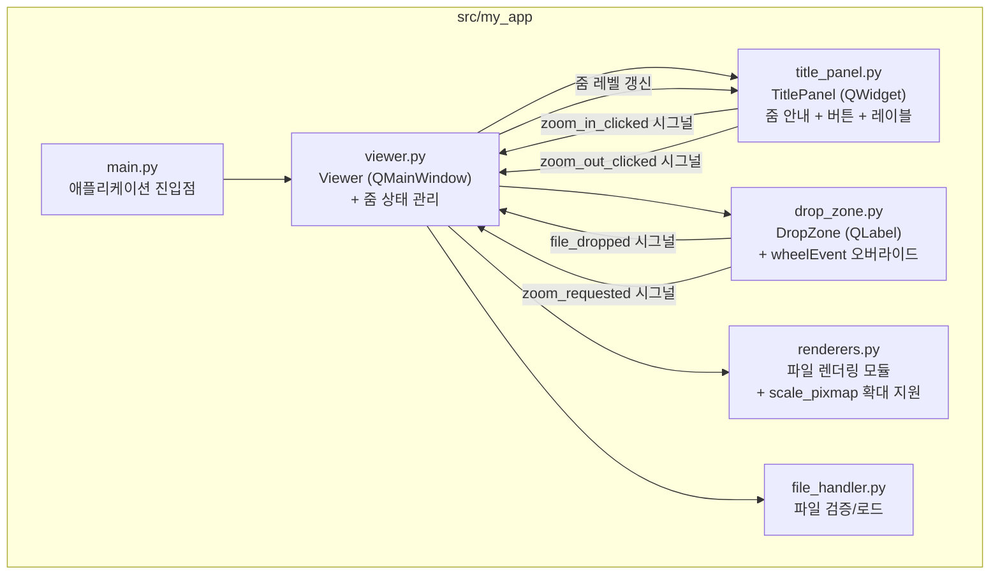
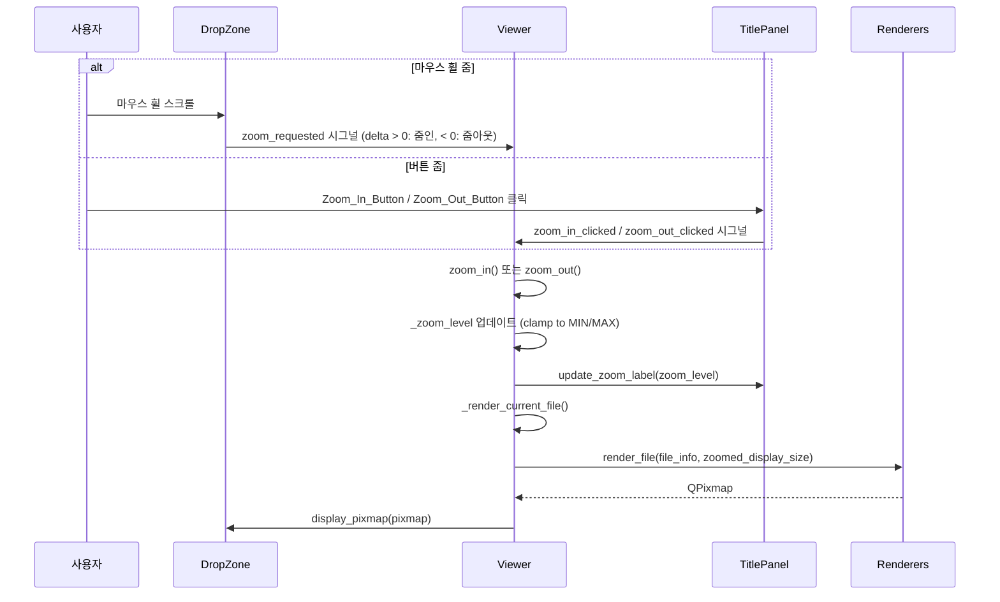
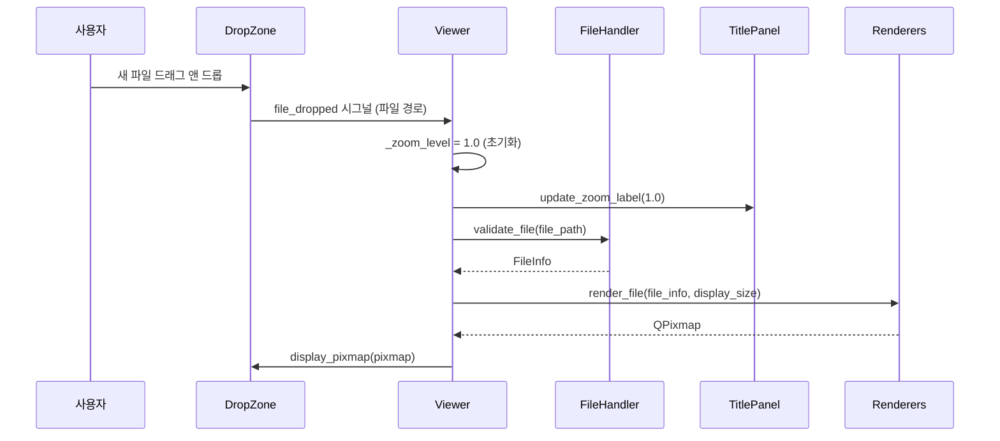

# 기술 설계 문서: 마우스 휠 줌 기능

## 개요

기존 PySide6 기반 이미지/문서 뷰어 애플리케이션에 마우스 휠 줌인/줌아웃 기능을 추가한다. 현재 뷰어는 파일을 윈도우 크기에 맞게 자동 축소하여 표시하지만, 사용자가 콘텐츠를 확대하거나 축소할 수 있는 방법이 없다. 이 설계는 마우스 휠 스크롤과 버튼 클릭을 통한 줌 기능, 그리고 줌 상태를 표시하는 타이틀 패널을 추가한다.

### 핵심 설계 원칙

1. **기존 코드 최소 수정**: 기존 모듈(`drop_zone.py`, `renderers.py`, `file_handler.py`)의 변경을 최소화하고, 줌 로직은 주로 `viewer.py`에 집중한다.
2. **단일 줌 경로**: 마우스 휠과 버튼 클릭 모두 동일한 `zoom_in()`/`zoom_out()` 메서드를 호출하여 동작 일관성을 보장한다.
3. **곱셈 기반 줌**: 줌 레벨에 `ZOOM_STEP`(1.25)을 곱하거나 나누어 로그 스케일로 자연스러운 줌 경험을 제공한다.

### 설계 결정 사항

| 결정 | 선택 | 이유 |
|------|------|------|
| 줌 레벨 관리 위치 | `Viewer` | Viewer가 렌더링 파이프라인을 제어하므로 줌 상태도 여기서 관리하는 것이 자연스럽다 |
| wheelEvent 오버라이드 위치 | `DropZone` | 마우스 휠 이벤트는 포커스가 있는 위젯에서 발생하며, 콘텐츠가 표시되는 DropZone이 적합하다 |
| 렌더링 방식 | `display_size * zoom_level` | 기존 `scale_pixmap` 대신 줌이 적용된 크기를 `render_file`에 전달하여 렌더링한다 |
| 타이틀 패널 구현 | 새로운 `TitlePanel` QWidget | Viewer 상단에 QVBoxLayout으로 배치하여 기존 DropZone 레이아웃에 영향을 최소화한다 |
| 줌 레벨 표시 | 백분율 (예: "100%") | 사용자가 직관적으로 이해할 수 있는 형식이다 |

## 아키텍처

### 전체 구조



### 줌 데이터 흐름



### 파일 드롭 시 줌 초기화 흐름



## 컴포넌트 및 인터페이스

### 1. title_panel.py — TitlePanel (신규)

```python
class TitlePanel(QWidget):
    """Viewer 상단에 배치되는 줌 컨트롤 패널."""

    zoom_in_clicked: Signal   # Signal() - 줌인 버튼 클릭
    zoom_out_clicked: Signal  # Signal() - 줌아웃 버튼 클릭

    def __init__(self, parent: QWidget | None = None) -> None:
        """안내 문구, 줌 버튼, 줌 레이블을 포함하는 수평 레이아웃을 구성한다."""

    def update_zoom_label(self, zoom_level: float) -> None:
        """줌 레이블을 백분율 형식(예: "100%")으로 갱신한다."""
```

**레이아웃 구조:**
```
┌─────────────────────────────────────────────────────────────┐
│ "마우스 휠로 줌인/줌아웃 가능"  [stretch]  [-] [100%] [+]   │
└─────────────────────────────────────────────────────────────┘
```

- QHBoxLayout 사용
- 왼쪽: 안내 문구 QLabel ("마우스 휠로 줌인/줌아웃 가능")
- 가운데: QSpacerItem (stretch)
- 오른쪽: Zoom_Out_Button (`-`), Zoom_Label (`100%`), Zoom_In_Button (`+`)

### 2. viewer.py — Viewer (수정)

```python
class Viewer(QMainWindow):
    """메인 윈도우. TitlePanel과 DropZone을 포함한다."""

    # 줌 상수
    ZOOM_STEP: float = 1.25
    MIN_ZOOM: float = 0.1
    MAX_ZOOM: float = 10.0
    DEFAULT_ZOOM: float = 1.0

    def __init__(self) -> None:
        """QVBoxLayout으로 TitlePanel + DropZone 배치, 줌 시그널 연결."""

    # 줌 메서드 (신규)
    def zoom_in(self) -> None:
        """줌 레벨을 ZOOM_STEP만큼 곱하여 확대한다. MAX_ZOOM을 초과하지 않는다."""

    def zoom_out(self) -> None:
        """줌 레벨을 ZOOM_STEP으로 나누어 축소한다. MIN_ZOOM 미만으로 내려가지 않는다."""

    def _apply_zoom(self) -> None:
        """현재 줌 레벨로 콘텐츠를 다시 렌더링하고 줌 레이블을 갱신한다."""

    # 기존 메서드 (수정)
    def _on_file_dropped(self, file_path: str) -> None:
        """줌 레벨을 1.0으로 초기화한 후 파일을 로드한다."""

    def _render_file(self, file_info: FileInfo) -> None:
        """줌 레벨이 적용된 display_size로 렌더링한다."""

    def _on_zoom_requested(self, delta: int) -> None:
        """DropZone의 zoom_requested 시그널 핸들러. delta > 0이면 zoom_in, < 0이면 zoom_out."""

    def resizeEvent(self, event: QResizeEvent) -> None:
        """윈도우 크기 변경 시 현재 줌 레벨을 유지하면서 재렌더링한다."""
```

**주요 변경 사항:**
- `setCentralWidget(drop_zone)` → QWidget + QVBoxLayout으로 TitlePanel과 DropZone을 수직 배치
- `_zoom_level: float` 인스턴스 변수 추가 (초기값 1.0)
- `_render_file`에서 `display_size`를 `_zoom_level`과 곱한 크기로 렌더링
- `_on_file_dropped`에서 줌 레벨 초기화 추가
- 오류 발생 시에도 줌 레벨 초기화

### 3. drop_zone.py — DropZone (수정)

```python
class DropZone(QLabel):
    """드래그 앤 드롭을 수신하고 파일 내용을 표시하는 위젯."""

    file_dropped: Signal  # Signal(str) - 기존
    zoom_requested: Signal  # Signal(int) - 신규: 휠 delta 전달

    def wheelEvent(self, event: QWheelEvent) -> None:
        """마우스 휠 이벤트를 zoom_requested 시그널로 전달한다."""
```

**주요 변경 사항:**
- `zoom_requested = Signal(int)` 시그널 추가
- `wheelEvent` 오버라이드: `event.angleDelta().y()` 값을 `zoom_requested` 시그널로 emit

### 4. renderers.py — scale_pixmap (수정)

```python
def scale_pixmap(pixmap: QPixmap, display_size: QSize) -> QPixmap:
    """QPixmap을 종횡비를 유지하면서 display_size에 맞게 스케일링한다.

    display_size가 원본보다 크면 확대, 작으면 축소한다.
    """
```

**주요 변경 사항:**
- 기존: 원본이 `display_size`보다 작으면 원본 크기 유지 (축소만)
- 변경: `display_size`에 맞게 항상 스케일링 (확대/축소 모두 지원)
- 줌 레벨이 1.0보다 클 때 확대가 가능해야 하므로 필요한 변경

## 데이터 모델

### 줌 관련 상수

| 상수 | 값 | 설명 |
|------|-----|------|
| `ZOOM_STEP` | `1.25` | 휠 한 단위당 줌 배율 변경 계수 (25% 증가/감소) |
| `MIN_ZOOM` | `0.1` | 최소 줌 배율 (10%) |
| `MAX_ZOOM` | `10.0` | 최대 줌 배율 (1000%) |
| `DEFAULT_ZOOM` | `1.0` | 초기 줌 배율 (100%) |

### 줌 레벨 계산

줌 레벨은 곱셈 기반으로 변경된다:

- **줌인**: `new_level = min(current_level * ZOOM_STEP, MAX_ZOOM)`
- **줌아웃**: `new_level = max(current_level / ZOOM_STEP, MIN_ZOOM)`

### 줌이 적용된 렌더링 크기 계산

```python
base_size: QSize = self._drop_zone.size()  # DropZone의 현재 크기
zoomed_size = QSize(
    int(base_size.width() * self._zoom_level),
    int(base_size.height() * self._zoom_level),
)
```

- `zoom_level == 1.0`: 기존과 동일하게 DropZone 크기에 맞춤
- `zoom_level > 1.0`: DropZone보다 큰 크기로 렌더링 (확대)
- `zoom_level < 1.0`: DropZone보다 작은 크기로 렌더링 (축소)

### 줌 레이블 포맷

```python
def format_zoom_label(zoom_level: float) -> str:
    return f"{round(zoom_level * 100)}%"
```

예시: `0.1` → `"10%"`, `1.0` → `"100%"`, `10.0` → `"1000%"`

### Viewer 레이아웃 구조

```
QMainWindow (Viewer)
└── QWidget (central_widget)
    └── QVBoxLayout
        ├── TitlePanel (고정 높이)
        │   └── QHBoxLayout
        │       ├── QLabel ("마우스 휠로 줌인/줌아웃 가능")
        │       ├── QSpacerItem (stretch)
        │       ├── QPushButton ("-")
        │       ├── QLabel ("100%")
        │       └── QPushButton ("+")
        └── DropZone (stretch, 나머지 공간 차지)
```


## 정확성 속성 (Correctness Properties)

*정확성 속성(property)은 시스템의 모든 유효한 실행에서 참이어야 하는 특성 또는 동작이다. 사람이 읽을 수 있는 명세와 기계가 검증할 수 있는 정확성 보장 사이의 다리 역할을 한다.*

### Property 1: 줌인 계산 정확성 (Zoom-In Calculation with Clamping)

*For any* 유효한 줌 레벨 값 `level` (MIN_ZOOM ≤ level ≤ MAX_ZOOM)에 대해, zoom_in 연산의 결과는 `min(level * ZOOM_STEP, MAX_ZOOM)`과 같아야 하며, 결과는 항상 MIN_ZOOM 이상 MAX_ZOOM 이하여야 한다.

**Validates: Requirements 1.1, 1.2, 8.1, 8.3**

### Property 2: 줌아웃 계산 정확성 (Zoom-Out Calculation with Clamping)

*For any* 유효한 줌 레벨 값 `level` (MIN_ZOOM ≤ level ≤ MAX_ZOOM)에 대해, zoom_out 연산의 결과는 `max(level / ZOOM_STEP, MIN_ZOOM)`과 같아야 하며, 결과는 항상 MIN_ZOOM 이상 MAX_ZOOM 이하여야 한다.

**Validates: Requirements 2.1, 2.2, 8.2, 8.4**

### Property 3: 줌 적용 스케일링 종횡비 보존 (Aspect Ratio Preservation under Zoom)

*For any* 원본 QPixmap 크기 (w, h)와 줌이 적용된 디스플레이 크기 (dw, dh)에 대해, `scale_pixmap`을 적용한 결과의 종횡비(w/h)는 원본의 종횡비와 동일해야 하며(정수 반올림 오차 ±1px 허용), 결과 크기는 디스플레이 크기를 초과하지 않아야 한다.

**Validates: Requirements 4.1, 4.2**

### Property 4: 리사이즈 시 줌 레벨 불변 (Zoom Level Invariance on Resize)

*For any* 줌 레벨이 설정된 Viewer에 대해, 윈도우 크기가 변경(resizeEvent)되더라도 줌 레벨 값은 변경 전과 동일해야 한다.

**Validates: Requirements 4.3**

### Property 5: 파일 드롭 시 줌 초기화 (Zoom Reset on File Drop)

*For any* 줌 레벨 상태에서, 새로운 파일이 드롭되면 줌 레벨은 항상 DEFAULT_ZOOM(1.0)으로 초기화되어야 한다. 파일 로드 성공/실패 여부와 관계없이 동일하게 적용된다.

**Validates: Requirements 5.1, 5.2**

### Property 6: 파일 미표시 상태에서 줌 무시 (No Zoom Without File)

*For any* 파일이 로드되지 않은 Viewer에 대해, 임의 횟수의 zoom_in 또는 zoom_out 호출 후에도 줌 레벨은 DEFAULT_ZOOM(1.0)으로 유지되어야 한다.

**Validates: Requirements 6.1, 8.5**

### Property 7: 줌 레이블 포맷 정확성 (Zoom Label Format Correctness)

*For any* 유효한 줌 레벨 값 `level` (MIN_ZOOM ≤ level ≤ MAX_ZOOM)에 대해, 줌 레이블 텍스트는 `f"{round(level * 100)}%"` 형식이어야 한다.

**Validates: Requirements 7.5, 7.6**

## 오류 처리

### 줌 관련 오류 처리

| 오류 상황 | 처리 방식 | 처리 위치 |
|-----------|-----------|-----------|
| 파일 미표시 상태에서 줌 시도 | 줌 동작 무시 (줌 레벨 변경 없음) | `Viewer.zoom_in()`, `Viewer.zoom_out()` |
| 줌 레벨이 MAX_ZOOM 초과 시도 | MAX_ZOOM으로 clamp | `Viewer.zoom_in()` |
| 줌 레벨이 MIN_ZOOM 미만 시도 | MIN_ZOOM으로 clamp | `Viewer.zoom_out()` |
| 줌 적용 렌더링 실패 | 오류 메시지 표시, 줌 레벨 유지 | `Viewer._render_file()` |
| 새 파일 드롭 시 검증 실패 | 오류 메시지 표시, 줌 레벨 1.0으로 초기화 | `Viewer._on_file_dropped()` |

### 기존 오류 처리 유지

기존 `FileValidationError`와 `RenderError` 처리 흐름은 변경하지 않는다. 줌 초기화 로직만 `_on_file_dropped` 시작 부분에 추가한다.

### 오류 처리 원칙

1. **줌 메서드는 예외를 발생시키지 않는다**: `zoom_in()`과 `zoom_out()`은 guard 조건(파일 미표시)과 clamping으로 모든 경우를 안전하게 처리한다.
2. **렌더링 실패 시 줌 레벨 유지**: 줌 레벨 변경 후 렌더링이 실패하면 오류 메시지를 표시하지만, 줌 레벨은 변경된 상태를 유지한다 (다음 렌더링 시도에서 사용).
3. **파일 드롭 시 항상 초기화**: 성공/실패 관계없이 줌 레벨을 1.0으로 초기화하여 일관된 상태를 보장한다.

## 테스트 전략

### 테스트 프레임워크 및 도구

| 도구 | 용도 |
|------|------|
| pytest | 테스트 실행기 |
| hypothesis | Property-based testing 라이브러리 |
| pytest-qt | PySide6 위젯 테스트 지원 |

### 이중 테스트 접근법

#### 1. Property-Based Tests (hypothesis)

각 정확성 속성에 대해 하나의 property-based 테스트를 작성한다. 최소 100회 반복 실행한다.

- **Property 1**: 임의의 유효 줌 레벨에서 zoom_in 호출 후 `min(level * 1.25, 10.0)` 검증
  - 태그: `Feature: mouse-wheel-zoom, Property 1: Zoom-In Calculation with Clamping`
- **Property 2**: 임의의 유효 줌 레벨에서 zoom_out 호출 후 `max(level / 1.25, 0.1)` 검증
  - 태그: `Feature: mouse-wheel-zoom, Property 2: Zoom-Out Calculation with Clamping`
- **Property 3**: 임의의 (width, height, display_width, display_height) 조합으로 scale_pixmap 호출 후 종횡비 보존 및 크기 제한 확인 (확대 포함)
  - 태그: `Feature: mouse-wheel-zoom, Property 3: Aspect Ratio Preservation under Zoom`
- **Property 4**: 임의의 줌 레벨 설정 후 resizeEvent 호출 시 줌 레벨 불변 확인
  - 태그: `Feature: mouse-wheel-zoom, Property 4: Zoom Level Invariance on Resize`
- **Property 5**: 임의의 줌 레벨 상태에서 파일 드롭 후 줌 레벨 == 1.0 확인
  - 태그: `Feature: mouse-wheel-zoom, Property 5: Zoom Reset on File Drop`
- **Property 6**: 파일 미로드 상태에서 임의 횟수의 zoom_in/zoom_out 후 줌 레벨 == 1.0 확인
  - 태그: `Feature: mouse-wheel-zoom, Property 6: No Zoom Without File`
- **Property 7**: 임의의 유효 줌 레벨에 대해 줌 레이블 포맷 == `f"{round(level*100)}%"` 확인
  - 태그: `Feature: mouse-wheel-zoom, Property 7: Zoom Label Format Correctness`

#### 2. Unit Tests (pytest)

구체적인 예제와 에지 케이스를 테스트한다.

- **줌 상수 테스트**:
  - `ZOOM_STEP == 1.25`, `MIN_ZOOM == 0.1`, `MAX_ZOOM == 10.0`, `DEFAULT_ZOOM == 1.0`

- **TitlePanel 위젯 테스트** (pytest-qt):
  - 안내 문구 "마우스 휠로 줌인/줌아웃 가능" 표시 확인
  - Zoom_In_Button, Zoom_Out_Button 존재 확인
  - Zoom_Label 초기값 "100%" 확인
  - update_zoom_label 호출 시 레이블 갱신 확인

- **DropZone wheelEvent 테스트** (pytest-qt):
  - 휠 이벤트 발생 시 zoom_requested 시그널 emit 확인
  - 시그널의 delta 값이 올바른지 확인

- **Viewer 줌 통합 테스트** (pytest-qt):
  - 파일 로드 후 zoom_in/zoom_out 동작 확인
  - 줌 레벨 경계값(MIN_ZOOM, MAX_ZOOM) 동작 확인
  - 파일 드롭 시 줌 초기화 확인
  - 파일 미표시 상태에서 줌 무시 확인

### 테스트 디렉토리 구조

```
tests/
├── conftest.py                # 공통 fixture
├── test_file_handler.py       # file_handler 단위 테스트 (기존)
├── test_renderers.py          # renderers 단위 테스트 (기존 + scale_pixmap 확대 테스트)
├── test_drop_zone.py          # DropZone 위젯 테스트 (기존 + wheelEvent 테스트)
├── test_title_panel.py        # TitlePanel 위젯 테스트 (신규)
├── test_viewer.py             # Viewer 통합 테스트 (기존 + 줌 테스트)
└── test_zoom_properties.py    # 줌 관련 property-based 테스트 (신규)
```

### Property-Based Testing 설정

```python
from hypothesis import given, settings, strategies as st

ZOOM_LEVEL = st.floats(min_value=0.1, max_value=10.0, allow_nan=False, allow_infinity=False)

@settings(max_examples=100)
@given(level=ZOOM_LEVEL)
def test_property_name(level: float) -> None:
    # Feature: mouse-wheel-zoom, Property N: property_text
    ...
```
