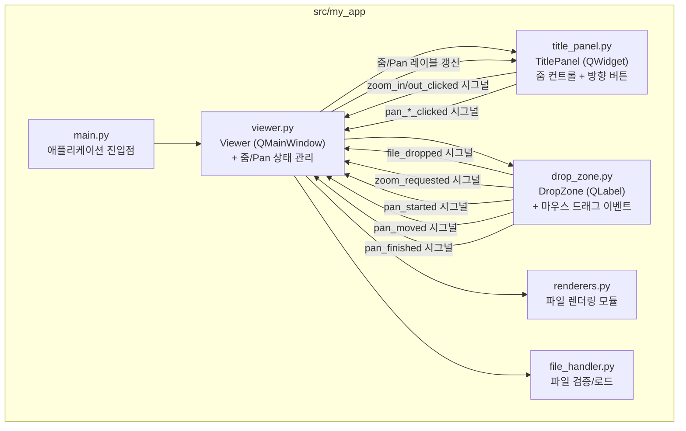
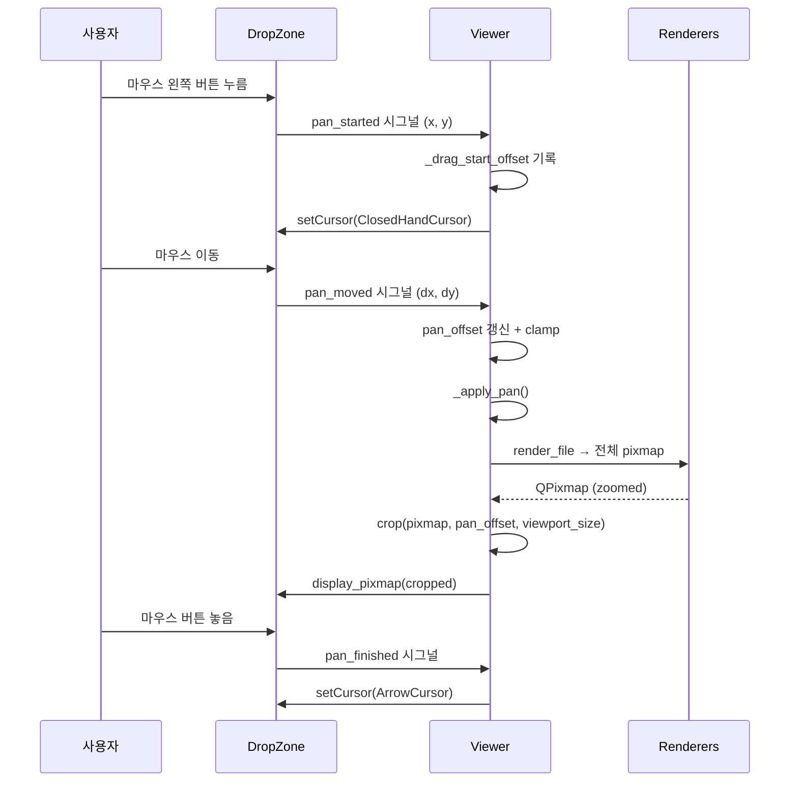
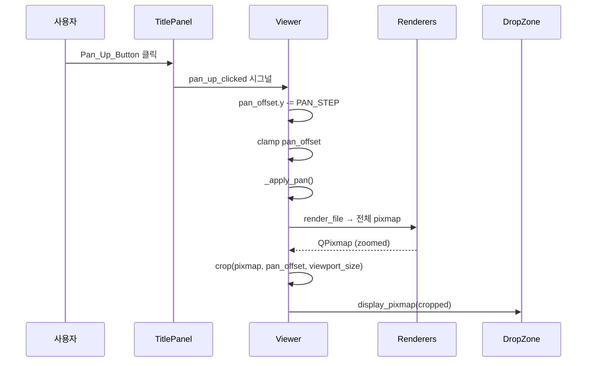
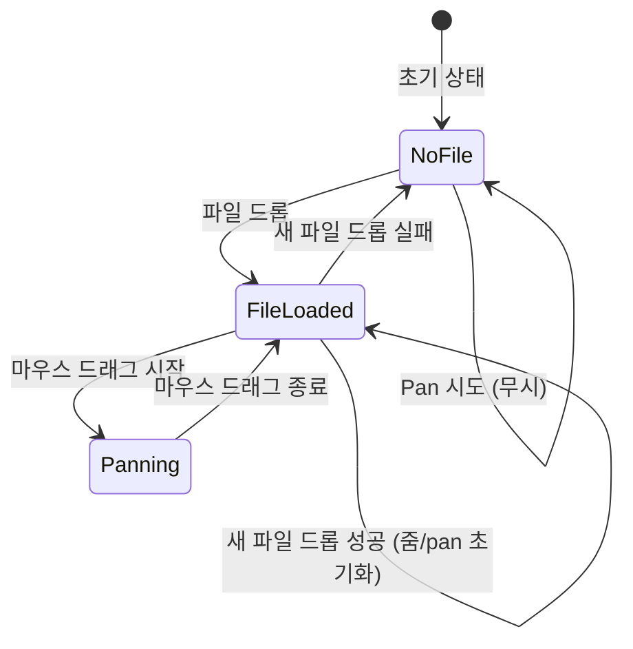

# 기술 설계 문서: Pan(이동) 네비게이션

## 개요

기존 PySide6 기반 이미지/문서 뷰어 애플리케이션에 Pan(이동) 기능을 추가한다. 현재 뷰어는 줌인 시 콘텐츠가 DropZone 영역보다 커지면 중앙 부분만 표시되고 가장자리가 잘려 보이지 않는다. 이 설계는 마우스 드래그와 방향 버튼을 통해 줌인된 콘텐츠의 보이지 않는 영역으로 뷰포트를 이동할 수 있게 한다.

### 핵심 설계 원칙

1. **Crop 기반 Pan**: 전체 렌더링된 pixmap에서 viewport 크기만큼 잘라내어(crop) 표시하는 방식으로 Pan을 구현한다. 스크롤바나 QScrollArea를 사용하지 않는다.
2. **중앙 기준 오프셋**: `pan_offset`은 `(0, 0)`이 중앙을 의미하며, 양수/음수 값으로 상하좌우 이동을 표현한다.
3. **Viewer 중심 상태 관리**: `pan_offset`은 `Viewer`에서 관리하며, DropZone은 마우스 이벤트만 시그널로 전달한다.
4. **기존 줌 파이프라인 확장**: 기존 `_render_file` 메서드에 crop 단계를 추가하여 Pan을 구현한다.

### 설계 결정 사항

| 결정 | 선택 | 이유 |
|------|------|------|
| Pan 구현 방식 | Crop 기반 | QScrollArea 대신 전체 pixmap을 렌더링 후 crop하면 기존 렌더링 파이프라인을 최소한으로 수정할 수 있다 |
| Pan 오프셋 관리 위치 | `Viewer` | 줌 레벨과 마찬가지로 Viewer가 렌더링 파이프라인을 제어하므로 Pan 상태도 여기서 관리한다 |
| 마우스 이벤트 처리 위치 | `DropZone` | 콘텐츠가 표시되는 위젯에서 마우스 이벤트를 받아 시그널로 전달하는 기존 패턴(wheelEvent)을 따른다 |
| 방향 버튼 위치 | `TitlePanel` | 기존 줌 버튼과 함께 배치하여 UI 일관성을 유지한다 |
| Pan 오프셋 좌표계 | 중앙 기준 (0,0) | 중앙이 기본 위치이므로 초기화가 직관적이고, 경계 계산이 대칭적이다 |
| Pan Step 크기 | 50px | 한 번 클릭에 적당한 이동량으로, 너무 작지도 크지도 않다 |

## 아키텍처

### 전체 구조



### Pan 데이터 흐름 — 마우스 드래그



### Pan 데이터 흐름 — 방향 버튼



## 컴포넌트 및 인터페이스

### 1. viewer.py — Viewer (수정)

```python
class Viewer(QMainWindow):
    """메인 윈도우. TitlePanel과 DropZone을 포함한다."""

    # 기존 줌 상수
    ZOOM_STEP: float = 1.25
    MIN_ZOOM: float = 0.1
    MAX_ZOOM: float = 10.0
    DEFAULT_ZOOM: float = 1.0

    # Pan 상수 (신규)
    PAN_STEP: int = 50  # 방향 버튼 한 번 클릭 시 이동 픽셀

    def __init__(self) -> None:
        """기존 초기화 + Pan 상태 변수 추가, 방향 버튼 시그널 연결."""
        # 신규 인스턴스 변수
        # self._pan_offset_x: int = 0
        # self._pan_offset_y: int = 0
        # self._drag_start_pos: QPoint | None = None
        # self._drag_start_offset: tuple[int, int] = (0, 0)

    # ------------------------------------------------------------------
    # Pan 메서드 (신규)
    # ------------------------------------------------------------------

    def _clamp_pan_offset(self, rendered_size: QSize, viewport_size: QSize) -> None:
        """Pan 오프셋을 경계 내로 제한한다.

        max_offset_x = max(0, (rendered_width - viewport_width) // 2)
        max_offset_y = max(0, (rendered_height - viewport_height) // 2)
        pan_offset_x = clamp(-max_offset_x, pan_offset_x, max_offset_x)
        pan_offset_y = clamp(-max_offset_y, pan_offset_y, max_offset_y)

        rendered가 viewport보다 작거나 같으면 offset은 (0, 0)이 된다.
        """

    def _crop_pixmap(self, pixmap: QPixmap, viewport_size: QSize) -> QPixmap:
        """전체 렌더링된 pixmap에서 pan_offset 기반으로 viewport 크기만큼 crop한다.

        crop 영역의 중심 = pixmap 중심 + pan_offset
        crop_x = (pixmap.width() - viewport.width()) // 2 + pan_offset_x
        crop_y = (pixmap.height() - viewport.height()) // 2 + pan_offset_y
        """

    def _apply_pan(self) -> None:
        """현재 pan_offset으로 콘텐츠를 다시 렌더링+crop하여 표시한다."""

    def _reset_pan_offset(self) -> None:
        """Pan 오프셋을 (0, 0)으로 초기화한다."""

    # 마우스 드래그 핸들러 (신규)
    def _on_pan_started(self, x: int, y: int) -> None:
        """드래그 시작 위치와 현재 오프셋을 기록한다."""

    def _on_pan_moved(self, dx: int, dy: int) -> None:
        """드래그 이동량만큼 pan_offset을 갱신하고 _apply_pan을 호출한다."""

    def _on_pan_finished(self) -> None:
        """드래그 종료 처리. 커서를 복원한다."""

    # 방향 버튼 핸들러 (신규)
    def _on_pan_up(self) -> None:
        """pan_offset_y를 PAN_STEP만큼 감소시킨다."""

    def _on_pan_down(self) -> None:
        """pan_offset_y를 PAN_STEP만큼 증가시킨다."""

    def _on_pan_left(self) -> None:
        """pan_offset_x를 PAN_STEP만큼 감소시킨다."""

    def _on_pan_right(self) -> None:
        """pan_offset_x를 PAN_STEP만큼 증가시킨다."""

    # 기존 메서드 (수정)
    def _apply_zoom(self) -> None:
        """줌 변경 시 pan_offset을 (0, 0)으로 초기화한 후 재렌더링한다."""

    def _on_file_dropped(self, file_path: str) -> None:
        """파일 드롭 시 줌 레벨과 pan_offset을 모두 초기화한다."""

    def _render_file(self, file_info: FileInfo) -> None:
        """줌 레벨이 적용된 크기로 전체 pixmap을 렌더링한 후,
        pan_offset 기반으로 crop하여 DropZone에 표시한다."""

    def resizeEvent(self, event: QResizeEvent) -> None:
        """리사이즈 시 pan_offset을 새 viewport에 맞게 clamp한 후 재렌더링한다."""
```

**주요 변경 사항:**
- `_pan_offset_x`, `_pan_offset_y` 인스턴스 변수 추가 (초기값 0)
- `_drag_start_pos`, `_drag_start_offset` 드래그 상태 변수 추가
- `_render_file`에 crop 단계 추가: 전체 pixmap 렌더링 → `_crop_pixmap` → `display_pixmap`
- `_apply_zoom`에서 `_reset_pan_offset()` 호출 추가
- `_on_file_dropped`에서 `_reset_pan_offset()` 호출 추가
- `resizeEvent`에서 `_clamp_pan_offset` 호출 추가
- TitlePanel 방향 버튼 시그널 연결 추가

### 2. drop_zone.py — DropZone (수정)

```python
class DropZone(QLabel):
    """드래그 앤 드롭을 수신하고 파일 내용을 표시하는 위젯."""

    file_dropped = Signal(str)       # 기존
    zoom_requested = Signal(int)     # 기존
    pan_started = Signal(int, int)   # 신규: 드래그 시작 (x, y)
    pan_moved = Signal(int, int)     # 신규: 드래그 이동 (dx, dy)
    pan_finished = Signal()          # 신규: 드래그 종료

    def mousePressEvent(self, event: QMouseEvent) -> None:
        """마우스 왼쪽 버튼 누름 시 pan_started 시그널을 emit한다."""

    def mouseMoveEvent(self, event: QMouseEvent) -> None:
        """드래그 중 pan_moved 시그널을 emit한다.
        dx, dy는 시작 위치 대비 현재 위치의 차이."""

    def mouseReleaseEvent(self, event: QMouseEvent) -> None:
        """마우스 버튼 놓음 시 pan_finished 시그널을 emit한다."""
```

**주요 변경 사항:**
- `pan_started`, `pan_moved`, `pan_finished` 시그널 3개 추가
- `mousePressEvent`: 왼쪽 버튼 누름 시 시작 위치 기록, `pan_started` emit
- `mouseMoveEvent`: 시작 위치 대비 이동량 계산, `pan_moved` emit
- `mouseReleaseEvent`: `pan_finished` emit, 시작 위치 초기화
- `_drag_start_pos: QPoint | None` 인스턴스 변수 추가 (DropZone 내부에서 delta 계산용)

### 3. title_panel.py — TitlePanel (수정)

```python
class TitlePanel(QWidget):
    """Viewer 상단에 배치되는 줌 컨트롤 + 방향 버튼 패널."""

    zoom_in_clicked = Signal()       # 기존
    zoom_out_clicked = Signal()      # 기존
    pan_up_clicked = Signal()        # 신규
    pan_down_clicked = Signal()      # 신규
    pan_left_clicked = Signal()      # 신규
    pan_right_clicked = Signal()     # 신규

    def __init__(self, parent: QWidget | None = None) -> None:
        """기존 줌 컨트롤 + 방향 버튼 4개를 포함하는 레이아웃을 구성한다."""
```

**레이아웃 구조:**
```
┌──────────────────────────────────────────────────────────────────────────┐
│ "마우스 휠로 줌인/줌아웃 가능"  [stretch]  [◀][▲][▼][▶]  [-][100%][+]  │
└──────────────────────────────────────────────────────────────────────────┘
```

- 기존 줌 컨트롤(-, 100%, +) 왼쪽에 방향 버튼 4개(◀ ▲ ▼ ▶) 추가
- 방향 버튼은 줌 버튼과 동일한 `setFixedWidth(30)` 스타일 적용

### 4. renderers.py — 변경 없음

렌더링 모듈은 변경하지 않는다. 기존 `render_file`이 `zoomed_size`로 전체 pixmap을 반환하며, crop은 Viewer에서 수행한다.

## 데이터 모델

### Pan 관련 상수

| 상수 | 값 | 설명 |
|------|-----|------|
| `PAN_STEP` | `50` | 방향 버튼 한 번 클릭 시 이동 픽셀 수 |

### Pan 오프셋 좌표계

```
pan_offset = (0, 0) → 콘텐츠 중앙 표시
pan_offset = (+x, 0) → 콘텐츠가 왼쪽으로 이동 (오른쪽 영역 표시)
pan_offset = (-x, 0) → 콘텐츠가 오른쪽으로 이동 (왼쪽 영역 표시)
pan_offset = (0, +y) → 콘텐츠가 위로 이동 (아래쪽 영역 표시)
pan_offset = (0, -y) → 콘텐츠가 아래로 이동 (위쪽 영역 표시)
```

### 경계 제한 계산

```python
def clamp_pan_offset(
    pan_offset_x: int,
    pan_offset_y: int,
    rendered_width: int,
    rendered_height: int,
    viewport_width: int,
    viewport_height: int,
) -> tuple[int, int]:
    """Pan 오프셋을 경계 내로 제한한다."""
    max_offset_x = max(0, (rendered_width - viewport_width) // 2)
    max_offset_y = max(0, (rendered_height - viewport_height) // 2)
    clamped_x = max(-max_offset_x, min(pan_offset_x, max_offset_x))
    clamped_y = max(-max_offset_y, min(pan_offset_y, max_offset_y))
    return (clamped_x, clamped_y)
```

- `rendered_size <= viewport_size`이면 `max_offset = 0`이므로 offset은 `(0, 0)`으로 고정된다.
- `rendered_size > viewport_size`이면 offset 범위는 `[-max_offset, +max_offset]`이다.

### Crop 영역 계산

```python
def compute_crop_rect(
    rendered_width: int,
    rendered_height: int,
    viewport_width: int,
    viewport_height: int,
    pan_offset_x: int,
    pan_offset_y: int,
) -> tuple[int, int, int, int]:
    """Crop 영역의 (x, y, width, height)를 계산한다."""
    crop_w = min(rendered_width, viewport_width)
    crop_h = min(rendered_height, viewport_height)
    crop_x = (rendered_width - crop_w) // 2 + pan_offset_x
    crop_y = (rendered_height - crop_h) // 2 + pan_offset_y
    return (crop_x, crop_y, crop_w, crop_h)
```

- `pan_offset = (0, 0)`이면 중앙 영역을 crop한다.
- `pan_offset != (0, 0)`이면 중앙에서 offset만큼 이동한 영역을 crop한다.

### 마우스 드래그 Pan 계산

```python
# DropZone에서:
# mousePressEvent: drag_start_pos = event.position().toPoint()
# mouseMoveEvent:
#   current_pos = event.position().toPoint()
#   dx = drag_start_pos.x() - current_pos.x()
#   dy = drag_start_pos.y() - current_pos.y()
#   pan_moved.emit(dx, dy)

# Viewer에서:
# _on_pan_started: drag_start_offset = (pan_offset_x, pan_offset_y)
# _on_pan_moved(dx, dy):
#   pan_offset_x = drag_start_offset[0] + dx
#   pan_offset_y = drag_start_offset[1] + dy
#   clamp + apply_pan
```

드래그 방향과 콘텐츠 이동 방향이 자연스럽게 일치하도록 `start - current`로 delta를 계산한다. 마우스를 오른쪽으로 드래그하면 콘텐츠가 왼쪽으로 이동하여 오른쪽 영역이 보인다.

### Viewer 상태 다이어그램




## 정확성 속성 (Correctness Properties)

*정확성 속성(property)은 시스템의 모든 유효한 실행에서 참이어야 하는 특성 또는 동작이다. 사람이 읽을 수 있는 명세와 기계가 검증할 수 있는 정확성 보장 사이의 다리 역할을 한다.*

### Property 1: 방향 버튼 Pan 오프셋 변경

*For any* 초기 pan_offset `(ox, oy)`와 임의의 방향(상/하/좌/우)에 대해, 해당 방향 버튼을 클릭하면 pan_offset은 clamp 적용 전 기준으로 해당 축이 `PAN_STEP(50)`만큼 변경되어야 한다. 구체적으로: 상 → `(ox, oy - 50)`, 하 → `(ox, oy + 50)`, 좌 → `(ox - 50, oy)`, 우 → `(ox + 50, oy)`. 변경 후 clamp가 적용되어 최종 값은 경계 내에 있어야 한다.

**Validates: Requirements 2.2, 2.3, 2.4, 2.5**

### Property 2: Pan 오프셋 경계 제한

*For any* rendered_size `(rw, rh)`, viewport_size `(vw, vh)`, pan_offset `(ox, oy)` 조합에 대해, clamp 함수 적용 후 결과 `(cx, cy)`는 다음을 만족해야 한다: `|cx| <= max(0, (rw - vw) // 2)` AND `|cy| <= max(0, (rh - vh) // 2)`. 특히 `rendered_size <= viewport_size`이면 결과는 반드시 `(0, 0)`이어야 한다.

**Validates: Requirements 3.1, 3.2, 3.3, 8.1**

### Property 3: Crop 영역 유효성

*For any* rendered_size `(rw, rh)`, viewport_size `(vw, vh)`, 유효한(clamp된) pan_offset `(ox, oy)` 조합에 대해, crop 영역 `(crop_x, crop_y, crop_w, crop_h)`는 다음을 만족해야 한다: `crop_x >= 0`, `crop_y >= 0`, `crop_x + crop_w <= rw`, `crop_y + crop_h <= rh`, `crop_w == min(rw, vw)`, `crop_h == min(rh, vh)`. 또한 `pan_offset = (0, 0)`이면 crop 영역은 rendered pixmap의 정중앙이어야 한다.

**Validates: Requirements 4.1, 4.2**

### Property 4: 드래그 Pan 오프셋 계산

*For any* 드래그 시작 위치 `(sx, sy)`, 현재 마우스 위치 `(cx, cy)`, 드래그 시작 시점의 pan_offset `(ox, oy)`에 대해, 드래그 중 pan_offset은 clamp 적용 전 기준으로 `(ox + (sx - cx), oy + (sy - cy))`이어야 한다.

**Validates: Requirements 1.2**

### Property 5: 줌 변경 시 Pan 초기화

*For any* pan_offset 상태 `(ox, oy)`에서, zoom_in 또는 zoom_out이 호출되면 pan_offset은 반드시 `(0, 0)`으로 초기화되어야 한다.

**Validates: Requirements 5.1**

### Property 6: 파일 드롭 시 Pan 초기화

*For any* pan_offset 상태 `(ox, oy)`에서, 새로운 파일이 드롭되면 pan_offset은 반드시 `(0, 0)`으로 초기화되어야 한다. 파일 로드 성공/실패 여부와 관계없이 동일하게 적용된다.

**Validates: Requirements 6.1**

### Property 7: 파일 미표시 상태에서 Pan 무시

*For any* 파일이 로드되지 않은 Viewer에 대해, 임의 횟수의 pan 동작(마우스 드래그 또는 방향 버튼 클릭) 후에도 pan_offset은 `(0, 0)`으로 유지되어야 한다.

**Validates: Requirements 7.1, 7.2**

## 오류 처리

### Pan 관련 오류 처리

| 오류 상황 | 처리 방식 | 처리 위치 |
|-----------|-----------|-----------|
| 파일 미표시 상태에서 드래그 시도 | Pan 동작 무시 (pan_offset 변경 없음) | `Viewer._on_pan_started()` |
| 파일 미표시 상태에서 방향 버튼 클릭 | Pan 동작 무시 (pan_offset 변경 없음) | `Viewer._on_pan_up/down/left/right()` |
| Pan 오프셋이 경계 초과 | 경계 내로 clamp | `Viewer._clamp_pan_offset()` |
| 렌더링된 콘텐츠가 viewport보다 작을 때 Pan 시도 | pan_offset을 (0, 0)으로 고정 (clamp에 의해 자동 처리) | `Viewer._clamp_pan_offset()` |
| 드래그 중 렌더링 실패 | 오류 메시지 표시, 드래그 모드 해제 | `Viewer._render_file()` |
| 리사이즈 후 pan_offset이 새 경계 초과 | 새 경계 내로 clamp | `Viewer.resizeEvent()` |

### 오류 처리 원칙

1. **Pan 메서드는 예외를 발생시키지 않는다**: guard 조건(파일 미표시)과 clamping으로 모든 경우를 안전하게 처리한다.
2. **드래그 상태는 항상 정리된다**: `mouseReleaseEvent`에서 드래그 상태를 초기화하고 커서를 복원한다.
3. **Clamp는 항상 적용된다**: pan_offset이 변경되는 모든 경로에서 clamp를 호출하여 경계 위반을 방지한다.

## 테스트 전략

### 테스트 프레임워크 및 도구

| 도구 | 용도 |
|------|------|
| pytest | 테스트 실행기 |
| hypothesis | Property-based testing 라이브러리 |
| pytest-qt | PySide6 위젯 테스트 지원 |

### 이중 테스트 접근법

#### 1. Property-Based Tests (hypothesis)

각 정확성 속성에 대해 하나의 property-based 테스트를 작성한다. 최소 100회 반복 실행한다.

- **Property 1**: 임의의 초기 pan_offset과 방향에 대해 방향 버튼 클릭 후 pan_offset 변경량 검증
  - 태그: `Feature: pan-navigation, Property 1: 방향 버튼 Pan 오프셋 변경`
- **Property 2**: 임의의 rendered_size, viewport_size, pan_offset에 대해 clamp 후 경계 내 검증
  - 태그: `Feature: pan-navigation, Property 2: Pan 오프셋 경계 제한`
- **Property 3**: 임의의 rendered_size, viewport_size, 유효 pan_offset에 대해 crop 영역 유효성 검증
  - 태그: `Feature: pan-navigation, Property 3: Crop 영역 유효성`
- **Property 4**: 임의의 드래그 시작/현재 위치와 초기 offset에 대해 드래그 pan_offset 계산 검증
  - 태그: `Feature: pan-navigation, Property 4: 드래그 Pan 오프셋 계산`
- **Property 5**: 임의의 pan_offset 상태에서 줌 변경 후 pan_offset == (0, 0) 검증
  - 태그: `Feature: pan-navigation, Property 5: 줌 변경 시 Pan 초기화`
- **Property 6**: 임의의 pan_offset 상태에서 파일 드롭 후 pan_offset == (0, 0) 검증
  - 태그: `Feature: pan-navigation, Property 6: 파일 드롭 시 Pan 초기화`
- **Property 7**: 파일 미로드 상태에서 임의의 pan 동작 후 pan_offset == (0, 0) 검증
  - 태그: `Feature: pan-navigation, Property 7: 파일 미표시 상태에서 Pan 무시`

#### 2. Unit Tests (pytest)

구체적인 예제와 에지 케이스를 테스트한다.

- **Pan 상수 테스트**:
  - `PAN_STEP == 50`

- **TitlePanel 방향 버튼 테스트** (pytest-qt):
  - Pan_Up_Button, Pan_Down_Button, Pan_Left_Button, Pan_Right_Button 존재 확인
  - 각 버튼 클릭 시 해당 시그널 emit 확인

- **DropZone 마우스 이벤트 테스트** (pytest-qt):
  - mousePressEvent 시 pan_started 시그널 emit 확인
  - mouseMoveEvent 시 pan_moved 시그널 emit 확인
  - mouseReleaseEvent 시 pan_finished 시그널 emit 확인

- **Viewer 드래그 커서 테스트** (pytest-qt):
  - 드래그 시작 시 ClosedHandCursor 확인
  - 드래그 종료 시 ArrowCursor 복원 확인

- **Viewer Pan 통합 테스트** (pytest-qt):
  - 파일 로드 후 방향 버튼으로 pan 이동 확인
  - 줌 변경 시 pan_offset 초기화 확인
  - 파일 드롭 시 pan_offset 초기화 확인
  - 파일 미표시 상태에서 pan 무시 확인

### Property-Based Testing 설정

```python
from hypothesis import given, settings, strategies as st

PAN_OFFSET = st.integers(min_value=-5000, max_value=5000)
DIMENSION = st.integers(min_value=1, max_value=5000)
DIRECTION = st.sampled_from(["up", "down", "left", "right"])

@settings(max_examples=100)
@given(
    pan_x=PAN_OFFSET,
    pan_y=PAN_OFFSET,
    rendered_w=DIMENSION,
    rendered_h=DIMENSION,
    viewport_w=DIMENSION,
    viewport_h=DIMENSION,
)
def test_property_name(...) -> None:
    # Feature: pan-navigation, Property N: property_text
    ...
```

### 테스트 디렉토리 구조

```
tests/
├── conftest.py                  # 공통 fixture
├── test_file_handler.py         # file_handler 단위 테스트 (기존)
├── test_renderers.py            # renderers 단위 테스트 (기존)
├── test_drop_zone.py            # DropZone 위젯 테스트 (기존 + 마우스 이벤트 테스트)
├── test_viewer.py               # Viewer 통합 테스트 (기존 + Pan 테스트)
└── test_pan_properties.py       # Pan 관련 property-based 테스트 (신규)
```

### 순수 함수 추출 전략

Property-based 테스트의 효율성을 위해 핵심 계산 로직을 순수 함수로 추출한다:

1. **`clamp_pan_offset(pan_x, pan_y, rendered_w, rendered_h, viewport_w, viewport_h) -> (int, int)`**: Pan 오프셋 경계 제한 계산. Qt 의존성 없이 테스트 가능.
2. **`compute_crop_rect(rendered_w, rendered_h, viewport_w, viewport_h, pan_x, pan_y) -> (int, int, int, int)`**: Crop 영역 계산. Qt 의존성 없이 테스트 가능.

이 순수 함수들은 `viewer.py` 내 모듈 수준 함수로 정의하거나, Viewer 클래스의 `@staticmethod`로 정의한다. Property-based 테스트는 이 순수 함수들을 직접 테스트하여 Qt 위젯 생성 오버헤드를 피한다.
